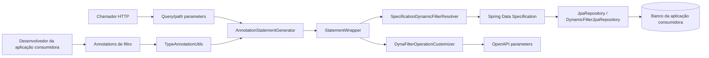
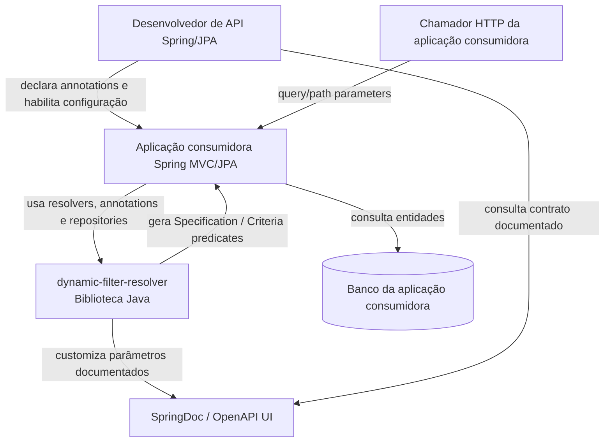
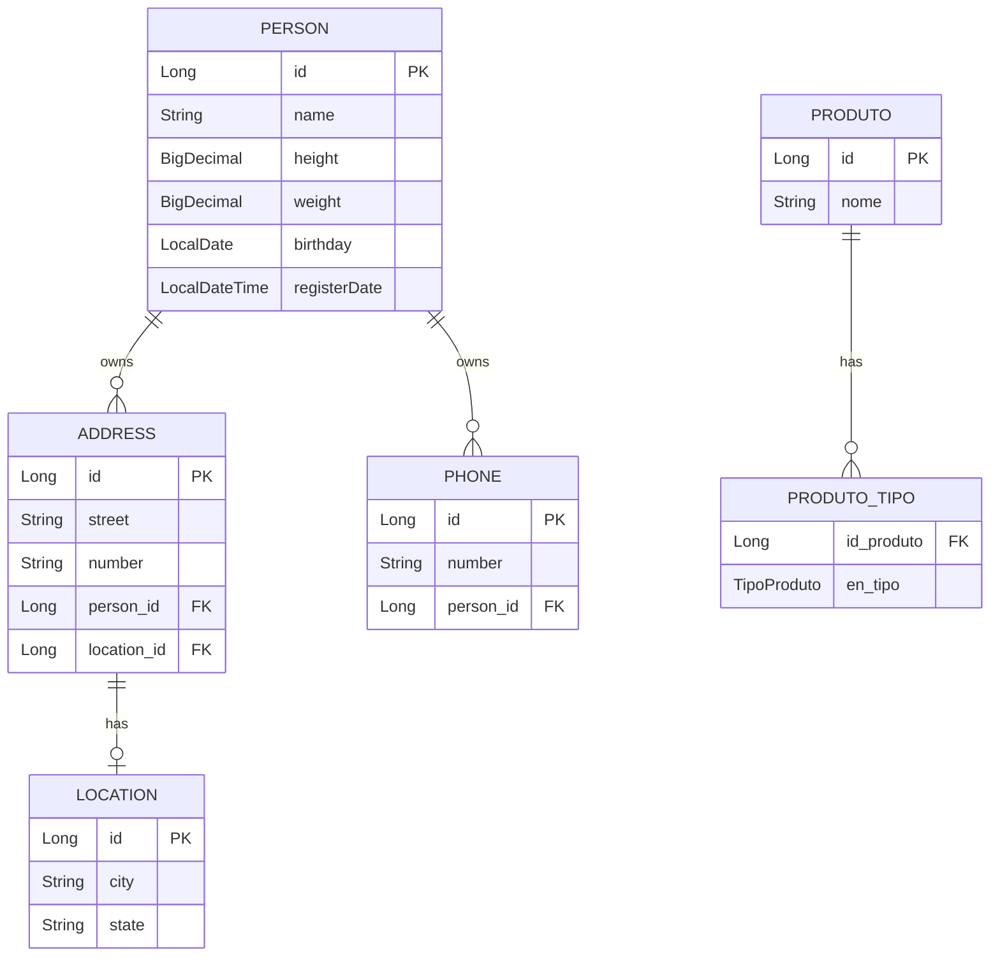

# Arquitetura — dynamic-filter-resolver

> Gerado pelo Reversa Architect em 2026-05-16.
> Escala de confiança: 🟢 CONFIRMADO, 🟡 INFERIDO, 🔴 LACUNA.

## Visão Geral

🟢 **CONFIRMADO** — `dynamic-filter-resolver` é uma biblioteca Java/Maven empacotada como `jar`. O módulo fornece infraestrutura para que aplicações Spring/JPA declarem filtros por annotations, resolvam parâmetros HTTP em uma árvore lógica intermediária e adaptem essa árvore para Spring Data JPA `Specification<?>` e SpringDoc OpenAPI.

🟢 **CONFIRMADO** — O sistema não é uma aplicação final com controllers próprios de produção. Ele expõe pontos de extensão para aplicações consumidoras Spring MVC/Spring Data JPA.

🟡 **INFERIDO** — O ator principal é o desenvolvedor de APIs Spring/JPA que quer reaproveitar contratos de filtro, reduzir repetição de Criteria API e manter documentação OpenAPI sincronizada com os filtros declarados.

## Estilo Arquitetural

🟢 **CONFIRMADO** — A arquitetura segue um núcleo técnico agnóstico de framework (`core`) com adaptadores para tecnologias específicas (`modules.jpa`, `modules.openapi`).

```text
Aplicação consumidora Spring
        |
        | annotations / parâmetros HTTP / controllers
        v
modules.jpa / modules.openapi
        |
        | usa modelo intermediário
        v
core
```

### Decisões Estruturais

| Decisão | Status | Evidência |
|---|---|---|
| Usar árvore de `Statement` como modelo intermediário estável. | 🟢 | `_reversa_sdd/adrs/001-statement-tree-as-intermediate-model.md`, `core/model/statement/*` |
| Manter contratos de filtro fora dos parâmetros de controller por meio de annotations externas. | 🟢 | `_reversa_sdd/adrs/002-filter-contracts-can-live-outside-controller-parameters.md` |
| Adaptar filtros para JPA via Spring Data `Specification`. | 🟢 | `SpecificationDynamicFilterResolver`, `SpecificationStatementAnalyser` |
| Documentar filtros em OpenAPI removendo o parâmetro técnico e adicionando parâmetros reais. | 🟢 | `DynaFilterOperationCustomizer` |
| Validar metadados cedo durante warmup Spring. | 🟢 | `FilterConfigurationAnalyserBeanPostProcessor` |

## Containers Arquiteturais

| Container lógico | Tecnologia | Responsabilidade | Confiança |
|---|---|---|---|
| Biblioteca `dynamic-filter-resolver` | Java 21, Maven | Entregar APIs, annotations, resolvers e adaptadores reutilizáveis. | 🟢 |
| Aplicação consumidora | Spring MVC, Spring Data JPA | Define controllers, entidades e repositories; habilita a biblioteca. | 🟡 |
| Banco da aplicação consumidora | JPA provider / banco externo | Persiste entidades reais consultadas pelos filtros. | 🟡 |
| Banco H2 de teste | H2, JPA test fixtures | Executa testes e benchmarks de integração do módulo. | 🟢 |
| Documentação OpenAPI | SpringDoc OpenAPI | Recebe parâmetros derivados dos filtros declarados. | 🟢 |

## Componentes Principais

| Componente | Pacote | Responsabilidade | Confiança |
|---|---|---|---|
| Annotation metadata | `core.generator.annotation` | Extrair, validar e cachear annotations de filtro. | 🟢 |
| Statement generation | `core.generator` | Computar valores, defaults, constantes, operações dinâmicas e criar árvore lógica. | 🟢 |
| Statement model | `core.model.statement` | Representar filtro lógico, composição, negação e ausência de filtro. | 🟢 |
| Operation dispatch | `core.operation` | Resolver operação declarativa para implementação concreta. | 🟢 |
| Filter decorators | `core.resolver`, `modules.jpa.resolver`, `modules.jpa.spring` | Decorar filtros gerados, incluindo fetch joins e decorators customizados. | 🟢 |
| JPA resolver | `modules.jpa.resolver` | Traduzir `StatementWrapper` para `Specification<?>`. | 🟢 |
| JPA operations | `modules.jpa.operation.specification` | Construir predicados Criteria API por operação. | 🟢 |
| MVC argument resolver | `modules.jpa.spring` | Converter query/path parameters em `ConditionalStatement` ou `Specification`. | 🟢 |
| Dynamic repository | `modules.jpa.repository` | Permitir métodos repository recebendo `ConditionalStatement`. | 🟢 |
| OpenAPI customizer | `modules.openapi` | Expandir filtro técnico em parâmetros OpenAPI individuais. | 🟢 |
| Performance support | `src/test/java/.../performance` | Medir hotspots com JMH e fixtures Spring/H2. | 🟢 |

## Fluxo Principal



## Integrações Externas

| Integração | Direção | Uso | Confiança |
|---|---|---|---|
| Spring Data JPA | Consumida | `Specification`, `JpaRepository`, `JpaSpecificationExecutor`, `SimpleJpaRepository`. | 🟢 |
| Jakarta Persistence Criteria API | Consumida | `Root`, `Path`, `Join`, `CriteriaBuilder`, `Predicate`, fetch joins. | 🟢 |
| Spring MVC | Consumida | `HandlerMethodArgumentResolver`, `WebMvcConfigurer`, `NativeWebRequest`. | 🟢 |
| Spring Framework context | Consumida | `GenericApplicationContext`, bean lookup/registration, value resolution. | 🟢 |
| SpringDoc OpenAPI | Consumida/estendida | `OperationCustomizer`, `Operation`, `Parameter`, `Schema`. | 🟢 |
| Jakarta Bean Validation | Consumida | Propaga constraints para schemas OpenAPI. | 🟢 |
| Runestone Toolkit | Consumida | `DataConversionService`, assertions e conversão de valores. | 🟢 |
| Caffeine | Consumida | Cache de metadata de annotations e paths JPA parseados. | 🟢 |
| H2 | Teste | Banco em memória para fixtures JPA. | 🟢 |
| JMH | Teste/performance | Microbenchmarks de geração, resolução, Criteria, proxy, cache e sort. | 🟢 |

## Dados e Persistência

🟢 **CONFIRMADO** — O módulo não define entidades JPA de produção nem migrations. As entidades JPA detectadas ficam em fixtures de teste.

🟢 **CONFIRMADO** — O modelo persistido real pertence à aplicação consumidora. A biblioteca opera sobre paths de entidade declarados em annotations e resolvidos via Criteria API.

🟢 **CONFIRMADO** — As entidades de teste são `Person`, `Address`, `Phone`, `Location`, `Produto` e o enum `TipoProduto`, usadas para validar joins, fetches, element collections e predicates.

## Segurança

🟢 **CONFIRMADO** — O módulo não implementa autenticação, autorização, RBAC, ACL, `@PreAuthorize`, `SecurityContext` ou papéis de usuário.

🟢 **CONFIRMADO** — A principal proteção indireta é que paths filtráveis são declarados no código por annotations, não enviados arbitrariamente pelo chamador HTTP.

🟡 **INFERIDO** — `constantValues` podem impor escopos técnicos de consulta, mas não substituem autorização na aplicação consumidora.

🟢 **CONFIRMADO PELO USUÁRIO** — A reconstrução deve oferecer mecanismo próprio de allowlist/denylist para impedir exposição acidental de filtros sobre campos sensíveis.

## Dívidas Técnicas e Riscos

| Item | Severidade | Confiança | Evidência |
|---|---|---|---|
| `DynaFilterOperationCustomizer` verifica `Disjunction.class` duas vezes e não `DisjunctionFrom.class`; reconstrução deve corrigir. | Média | 🟢 | `DynaFilterOperationCustomizer.java:63-64`, confirmação do usuário em `_reversa_sdd/questions.md#pergunta-2` |
| `DynamicFilterJpaRepositoryImpl` depende de injeção tardia por `DynamicFilterJpaRepositoryBeanPostProcessor`; uso sem resolver deve falhar explicitamente. | Média | 🟢 | `DynamicFilterJpaRepositoryImpl.java:57-64`, confirmação do usuário em `_reversa_sdd/questions.md#pergunta-3` |
| Método público `convertoToSpecification` contém erro de digitação, mas renomear seria breaking change. | Baixa | 🟢 | `DynamicFilterJpaRepository.java`, `DynamicFilterJpaRepositoryImpl.java` |
| Proxies customizados de `Specification` têm contrato limitado a `toPredicate`; default methods/Object methods ficam fora do escopo obrigatório. | Média | 🟢 | Testes desabilitados em `TestSpecDynaFilterArgumentResolver`, confirmação do usuário em `_reversa_sdd/questions.md#pergunta-4` |
| `TypeAnnotationUtils.findFilterField` deve falhar explicitamente para wildcards, collection raw ou tipos genéricos não materializados. | Média | 🟢 | `TypeAnnotationUtils.java:345-349`, confirmação do usuário em `_reversa_sdd/questions.md#pergunta-1` |
| OpenAPI customizer tem pouca cobertura direta em testes, apesar de `SchemaValidationUtils` estar coberto. | Média | 🟡 | `_reversa_sdd/modules.openapi/legacy-mapping.md` |
| Runner manual JMH executa apenas `DynamicFilterResolverBenchmark`, não todos os benchmarks existentes. | Baixa | 🟡 | `_reversa_sdd/test-support.performance/legacy-mapping.md` |

## Resumo C4 Contexto



## ERD Resumido

🟢 **CONFIRMADO** — ERD aplicável apenas às fixtures JPA de teste, não a um schema produtivo do módulo.



## Lacunas Arquiteturais

🔴 **LACUNA** — Não há deployment produtivo dentro do módulo: nenhum `Dockerfile`, `docker-compose`, pipeline CI/CD local ou configuração cloud foi encontrado.

🟢 **CONFIRMADO PELO USUÁRIO** — Logs, métricas e tracing permanecem responsabilidade da aplicação consumidora; a biblioteca não precisa emitir observabilidade própria neste escopo.

🔴 **LACUNA** — Não há schema de banco produtivo; o ERD representa somente fixtures de teste.
