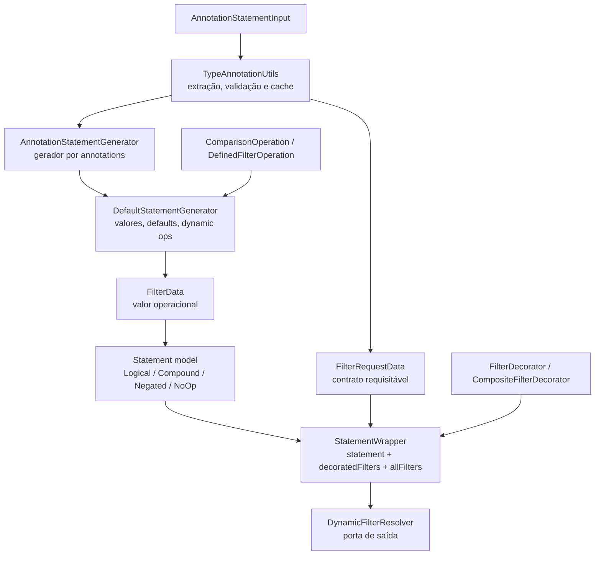
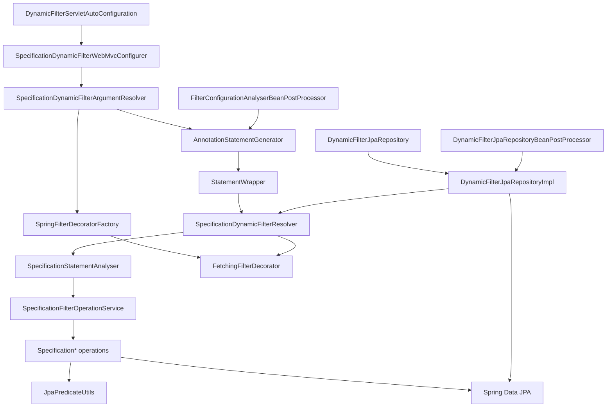
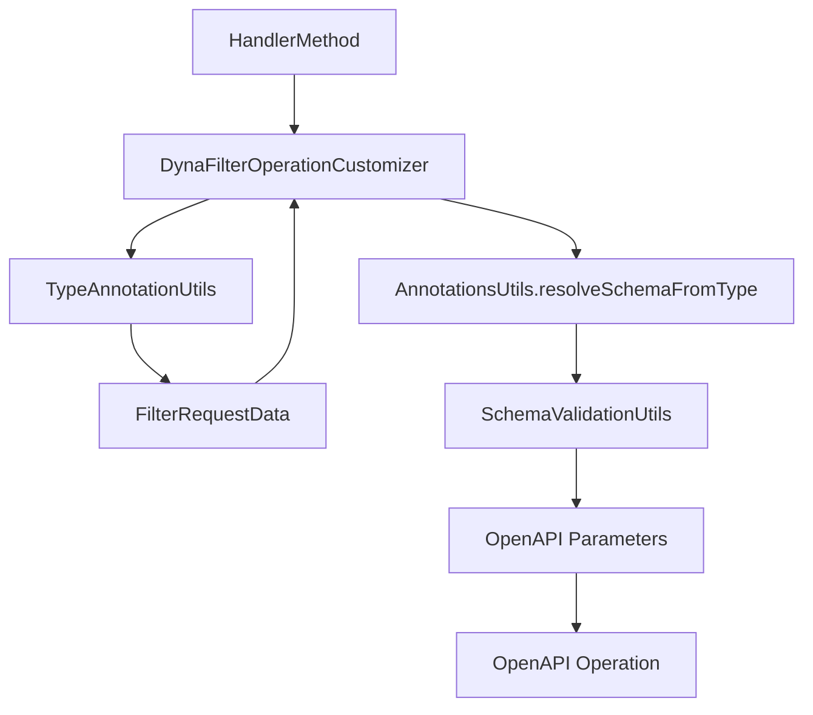

# C4 Componentes — dynamic-filter-resolver

> Gerado pelo Reversa Architect em 2026-05-16.
> Escala de confiança: 🟢 CONFIRMADO, 🟡 INFERIDO, 🔴 LACUNA.

## Componentes do `core`

| Componente | Responsabilidade | Principais tipos | Confiança |
|---|---|---|---|
| Annotation metadata | Descobrir annotations diretas, meta-annotations, interfaces, superclasses e contratos externos. | `TypeAnnotationUtils`, `AnnotationStatementInput`, `FilterAnnotationData`. | 🟢 |
| Statement generation | Computar filtros aplicáveis, regras de obrigatoriedade, defaults, constantes e operações dinâmicas. | `AnnotationStatementGenerator`, `DefaultStatementGenerator`. | 🟢 |
| Statement model | Representar a DSL lógica intermediária visitável/analisável. | `LogicalStatement`, `CompoundStatement`, `NegatedStatement`, `NoOpStatement`. | 🟢 |
| Filter model | Separar contrato requisitável de dado operacional já resolvido. | `FilterRequestData`, `FilterData`, `StatementWrapper`. | 🟢 |
| Operation model | Mapear códigos dinâmicos e interfaces marcadoras. | `ComparisonOperation`, `DefinedFilterOperation`, `types/*`. | 🟢 |
| Decorator port | Permitir extensão thread-safe/stateless sobre filtros concretos. | `FilterDecorator`, `CompositeFilterDecorator`, `FilterDecoratorFactory`. | 🟢 |

## Componentes do `modules.jpa`

| Componente | Responsabilidade | Principais tipos | Confiança |
|---|---|---|---|
| Servlet auto-config | Registrar beans padrão e Web MVC configurer quando a biblioteca é habilitada. | `DynamicFilterServletAutoConfiguration`, `EnableDynamicFilterServletConfiguration`. | 🟢 |
| MVC resolver | Converter request em `ConditionalStatement`, `Specification` ou proxy de interface. | `SpecificationDynamicFilterArgumentResolver`. | 🟢 |
| Spring decorators | Resolver decorators customizados e fetch decorators via ApplicationContext com cache. | `SpringFilterDecoratorFactory`. | 🟢 |
| JPA resolver | Converter `StatementWrapper` para `Specification<?>` e aplicar decorator opcional. | `SpecificationDynamicFilterResolver`, `SpecificationStatementAnalyser`. | 🟢 |
| Operation service | Registrar operações do core em implementações JPA. | `SpecificationFilterOperationService`, `Specification*`. | 🟢 |
| Predicate utilities | Parsear paths, cachear path parseado, criar/reusar joins e converter valores comparáveis. | `JpaPredicateUtils`. | 🟢 |
| Fetch decorator | Criar fetch joins em query normal, pular count query, deduplicar paths. | `FetchingFilterDecorator`, `@Fetching`, `@Fetches`. | 🟢 |
| Dynamic repository | Executar `ConditionalStatement` diretamente em APIs Spring Data. | `DynamicFilterJpaRepository`, `DynamicFilterJpaRepositoryImpl`, BPP. | 🟢 |
| Config warmup | Validar filtros em controllers durante inicialização. | `FilterConfigurationAnalyserBeanPostProcessor`. | 🟢 |

## Componentes do `modules.openapi`

| Componente | Responsabilidade | Principais tipos | Confiança |
|---|---|---|---|
| Operation customizer | Remover parâmetro técnico e criar parâmetros documentados por filtro. | `DynaFilterOperationCustomizer`. | 🟢 |
| Schema validation | Copiar constraints Bean Validation para schemas OpenAPI. | `SchemaValidationUtils`. | 🟢 |
| Schema inference | Resolver schema por tipo de field e `JsonView`. | `AnnotationsUtils.resolveSchemaFromType`, `JsonView`. | 🟢 |

## Componentes de Teste e Performance

| Componente | Responsabilidade | Principais tipos | Confiança |
|---|---|---|---|
| Benchmark baseline | Medir geração, resolução, argument resolver e cache de annotations. | `DynamicFilterResolverBenchmark`. | 🟢 |
| Benchmark Criteria/fetch/cache | Medir predicates pesados, paths repetidos, fetches e cache sob pressão. | `DynamicFilterResolverPerf02Benchmark`. | 🟢 |
| Benchmark proxy | Comparar custo de invocação de proxy `Specification`. | `DynamicFilterResolverPerf06ProxyBenchmark`. | 🟢 |
| Benchmark sort | Comparar tradução de sort otimizada e legado. | `DynamicFilterRepositorySortPerfBenchmark`. | 🟢 |
| Fixtures JPA | Entidades e H2 para validar joins, fetches e element collections. | `Person`, `Address`, `Phone`, `Location`, `Produto`, `TipoProduto`. | 🟢 |

## Componentes com Atenção Arquitetural

| Componente | Risco | Confiança |
|---|---|---|
| `DynaFilterOperationCustomizer` | `@DisjunctionFrom` isolado deve ser corrigido na reconstrução. | 🟢 |
| `DynamicFilterJpaRepositoryImpl` | Depende de BPP para injeção tardia do resolver; uso sem resolver deve falhar explicitamente. | 🟢 |
| Proxy de interface `Specification` | Contrato limitado a `toPredicate`; default methods/Object methods fora do escopo obrigatório. | 🟢 |
| `TypeAnnotationUtils.findFilterField` | Generics/wildcards/raw collections devem falhar com `DynamicFilterConfigurationException` explícita. | 🟢 |
