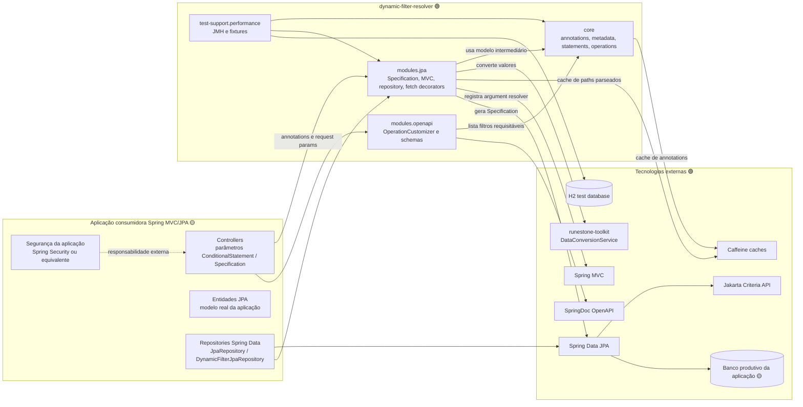

# C4 Containers — dynamic-filter-resolver

> Gerado pelo Reversa Architect em 2026-05-16.
> Escala de confiança: 🟢 CONFIRMADO, 🟡 INFERIDO, 🔴 LACUNA.

## Diagrama

## Containers Lógicos

| Container | Tecnologia | Responsabilidade | Deploy | Confiança |
|---|---|---|---|---|
| `core` | Java 21 | Modelo agnóstico de filtros, annotations, extração de metadados, geração de statements e abstrações de resolver/decorator. | Dentro do jar da biblioteca. | 🟢 |
| `modules.jpa` | Java 21, Spring MVC, Spring Data JPA | Resolver MVC, conversão de statements para `Specification`, operações Criteria, repositories dinâmicos e fetch decorators. | Dentro do jar da biblioteca; ativado pela aplicação consumidora. | 🟢 |
| `modules.openapi` | Java 21, SpringDoc OpenAPI | Customizar documentação OpenAPI com parâmetros derivados dos filtros. | Dentro do jar da biblioteca; usado quando SpringDoc estiver no classpath. | 🟢 |
| `test-support.performance` | Java 21, JMH, Spring Test, H2 | Benchmarks e fixtures de performance/integração. | Escopo de teste, não produção. | 🟢 |
| Aplicação consumidora | Spring Boot / Spring MVC / Spring Data JPA | Define endpoints, entidades, autorização, dados reais e habilita a biblioteca. | Fora deste módulo. | 🟡 |
| Banco produtivo | Banco compatível com JPA provider | Armazena entidades reais consultadas por filtros. | Fora deste módulo. | 🟡 |

## Comunicações

| Origem | Destino | Protocolo/API | Dados | Confiança |
|---|---|---|---|---|
| Controller consumidor | `SpecificationDynamicFilterArgumentResolver` | Spring MVC SPI | `MethodParameter`, `NativeWebRequest`, query/path params. | 🟢 |
| `AnnotationStatementGenerator` | `TypeAnnotationUtils` | Chamada Java | `AnnotationStatementInput`, annotations e metadados. | 🟢 |
| `SpecificationDynamicFilterResolver` | `SpecificationStatementAnalyser` | Visitor/analyser Java | `StatementWrapper`, `AbstractStatement`. | 🟢 |
| `Specification*` | Criteria API | JPA Criteria | `Root`, `Path`, `CriteriaBuilder`, `Predicate`. | 🟢 |
| `DynamicFilterJpaRepositoryImpl` | `SimpleJpaRepository` | Spring Data JPA API | `Specification`, `Pageable`, `Sort`, `EntityGraph`. | 🟢 |
| `DynaFilterOperationCustomizer` | SpringDoc | OpenAPI model API | `Operation`, `Parameter`, `Schema`. | 🟢 |
| Benchmarks | H2 / Spring Test | JDBC/JPA via Spring | Fixtures `Person`, `Produto` e relacionamentos. | 🟢 |

## Limites de Responsabilidade

🟢 **CONFIRMADO** — A biblioteca decide como transformar contratos de filtro em statements, `Specification` e documentação.

🟢 **CONFIRMADO** — A aplicação consumidora decide quais filtros existem, quais campos podem ser expostos, autenticação/autorização e transações de negócio.

🔴 **LACUNA** — Não há container de runtime autônomo, fila, cache distribuído, serviço externo HTTP consumido, CI/CD local ou deployment próprio detectado neste módulo.
