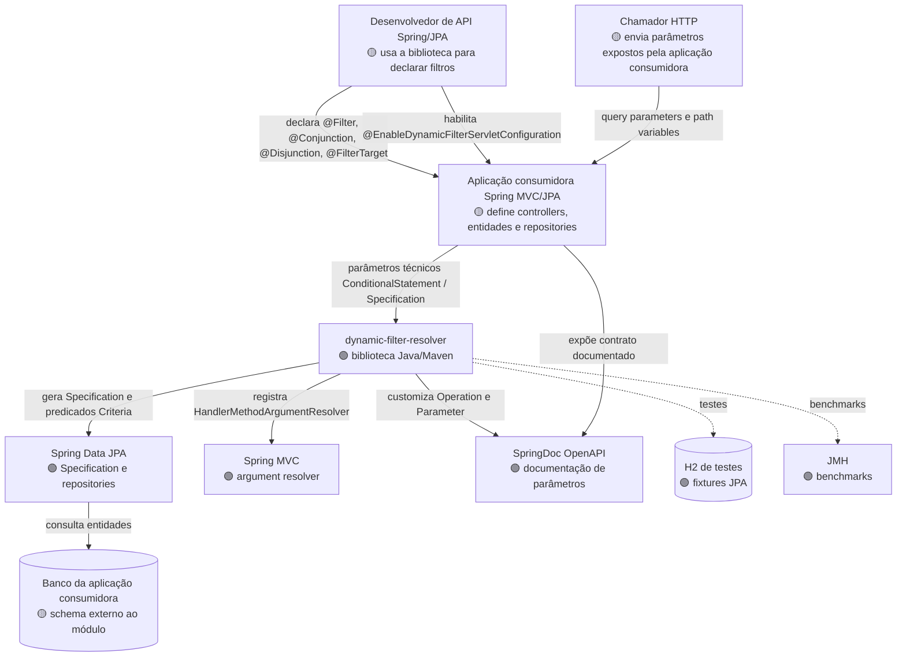

# C4 Contexto — dynamic-filter-resolver

> Gerado pelo Reversa Architect em 2026-05-16.
> Escala de confiança: 🟢 CONFIRMADO, 🟡 INFERIDO, 🔴 LACUNA.

## Diagrama

## Pessoas e Sistemas

| Elemento | Tipo | Relação com o sistema | Confiança |
|---|---|---|---|
| Desenvolvedor de API Spring/JPA | Pessoa | Declara filtros, decorators, fetches e entidade alvo. | 🟡 |
| Chamador HTTP | Pessoa/sistema externo | Envia query/path parameters documentados pela aplicação consumidora. | 🟡 |
| Aplicação consumidora | Sistema externo | Hospeda controllers, repositories, entidades, segurança e banco produtivo. | 🟡 |
| dynamic-filter-resolver | Sistema analisado | Fornece annotations, resolvers, adapters JPA e customização OpenAPI. | 🟢 |
| Spring Data JPA | Sistema/biblioteca externa | Executa `Specification<?>` e Criteria API. | 🟢 |
| Spring MVC | Sistema/biblioteca externa | Permite resolver parâmetros de controller. | 🟢 |
| SpringDoc OpenAPI | Sistema/biblioteca externa | Recebe parâmetros OpenAPI derivados dos filtros. | 🟢 |
| Banco da aplicação consumidora | Sistema externo | Armazena dados reais filtrados pela aplicação. | 🟡 |
| H2 de testes | Sistema externo de teste | Executa integração JPA no módulo. | 🟢 |
| JMH | Ferramenta externa | Mede hotspots da biblioteca. | 🟢 |

## Observações

🟢 **CONFIRMADO** — O módulo não expõe endpoints HTTP próprios de produção.

🟢 **CONFIRMADO** — Spring e SpringDoc estão em escopo `provided`, coerente com biblioteca integrada por aplicações consumidoras.

🔴 **LACUNA** — Segurança, banco produtivo, deployment e observabilidade ficam fora do escopo local deste módulo.
