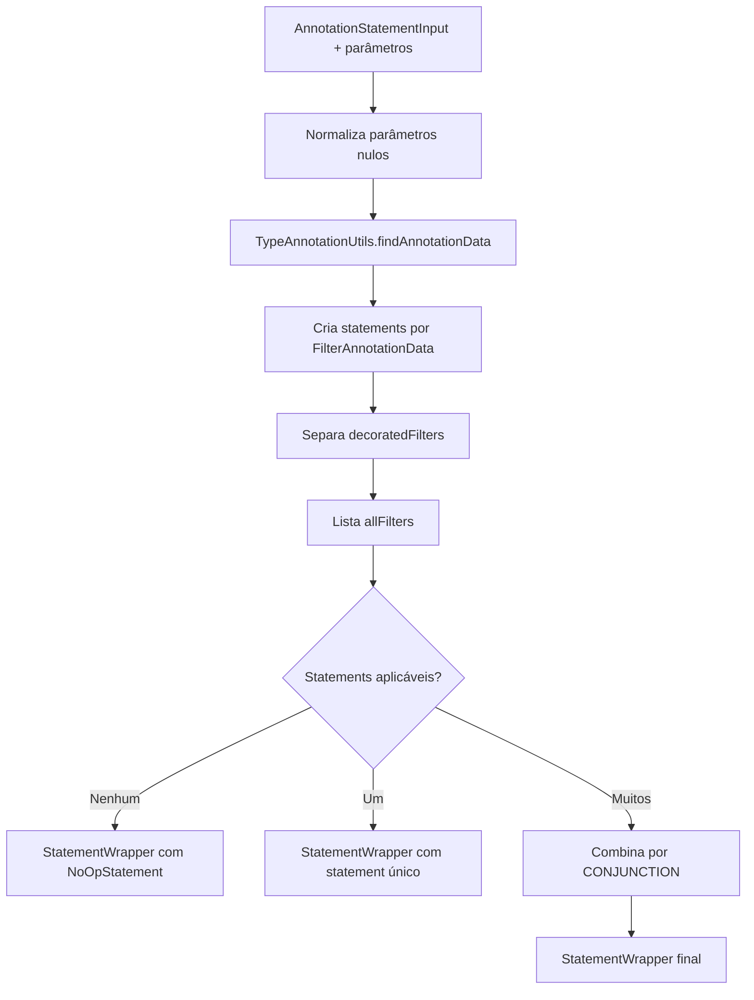

# Core, Design Técnico

> Spec operacional gerada pelo Reversa Writer em 2026-05-16.
> Escala de confiança: 🟢 CONFIRMADO, 🟡 INFERIDO, 🔴 LACUNA.

## Interface

🟢 **CONFIRMADO** — A unit `core` não expõe endpoints HTTP. Ela expõe classes, records, annotations e interfaces Java consumidas pelos adaptadores do próprio módulo e por aplicações/integrações externas.

### Interfaces e Classes Principais

| Símbolo | Assinatura | Retorno | Observação |
|---------|-----------|---------|------------|
| `StatementGenerator.generateStatements` | `(AnnotationStatementInput filterInputs, Map<String, Object> filterParameters)` | `StatementWrapper` | 🟢 Contrato de geração de statements a partir de metadados e parâmetros. |
| `AnnotationStatementGenerator.generateStatements` | `(AnnotationStatementInput filterInputs, Map<String, Object> filterParameters)` | `StatementWrapper` | 🟢 Implementação baseada em annotations. |
| `DefaultStatementGenerator.createFilterData` | `(String path, String[] parameters, Class<?> targetType, Class<? super DefinedFilterOperation> operation, Object negateParameter, Object[] values, List<Class<? extends FilterModifier>> modifiers, String description)` | `FilterData` | 🟢 Computa negação, operação dinâmica e dados operacionais. |
| `DefaultStatementGenerator.computeValues` | `(String[] parameters, Object[] defaultValues, Object[] constantValues, Map<String, Object> parametersMap)` | `Object[]` | 🟢 Aplica precedência de valores e resolução de expressões. |
| `TypeAnnotationUtils.findAnnotationData` | `(AnnotationStatementInput annotationStatementInput)` | `List<FilterAnnotationData>` | 🟢 Retorna blocos lógicos extraídos de annotations. |
| `TypeAnnotationUtils.listAllFilterRequestData` | `(AnnotationStatementInput annotationStatementInput)` | `List<FilterRequestData>` | 🟢 Lista filtros requisitáveis para documentação e adaptadores. |
| `TypeAnnotationUtils.findFilterField` | `(Class<?> clazz, String fieldName)` | `Field` | 🟢 Resolve path simples ou dot-notation, incluindo navegação por collections parametrizadas. |
| `TypeAnnotationUtils.findFilterTargetClass` | `(AnnotationStatementInput annotationStatementInput)` | `Class<?>` | 🟢 Identifica entidade alvo a partir de annotations ou tipo `Specification<T>`/`ConditionalStatement`. |
| `FilterOperationService.createFilter` | `(FilterData filterData)` | `T` | 🟢 Porta para transformar `FilterData` em filtro concreto. |
| `DynamicFilterResolver.createFilter` | `(StatementWrapper statementWrapper, FilterDecorator<T> decorator)` | `R` | 🟢 Porta para resolver a árvore em tecnologia concreta. |
| `FilterDecorator.decorate` | `(T filter, StatementWrapper statementWrapper)` | `T` | 🟢 Ponto de extensão para envolver ou modificar filtro concreto. |

### Modelos de Dados

| Tipo | Campos principais | Função | Confiança |
|---|---|---|---|
| `FilterRequestData` | `path`, `parameters`, `targetType`, `operation`, `negate`, `defaultValues`, `constantValues`, `format`, `required`, `modifiers`, `description` | Contrato requisitável/documentável de filtro. | 🟢 |
| `FilterData` | `path`, `parameters`, `targetType`, `operation`, `negate`, `values`, `modifiers`, `description` | Dados já resolvidos para operação concreta. | 🟢 |
| `StatementWrapper` | `statement`, `decoratedFilters`, `allFilters` | Envelope da árvore lógica, filtros decorados e catálogo de filtros. | 🟢 |
| `ConditionalStatement` | `statementWrapper`, `filterDecorator` | Container consumido por adaptadores, especialmente JPA. | 🟢 |
| `AnnotationStatementInput` | `type`, `annotations`, `cachedHashCode` | Chave de análise/caching com clone defensivo de annotations. | 🟢 |
| `FilterAnnotationData` | `logicOperator`, `filters`, `filterStatements`, `negate` | Bloco lógico extraído de annotations. | 🟢 |
| `FilterAnnotationStatement` | `filters`, `negate` | Sub-statement extraído de annotations inline ou externas. | 🟢 |

### Annotations de Entrada

| Annotation | Target | Papel | Confiança |
|---|---|---|---|
| `@Filter` | `FIELD` | Declara path, parâmetros, operação, defaults, constantes, required e modifiers. | 🟢 |
| `@Conjunction` | `PARAMETER`, `TYPE` | Agrupa filtros por AND. | 🟢 |
| `@Disjunction` | `PARAMETER`, `TYPE` | Agrupa filtros por OR. | 🟢 |
| `@Statement` | Elemento de annotation | Declara sub-statement inline. | 🟢 |
| `@ConjunctionFrom` | `PARAMETER`, `TYPE` | Referencia contrato externo combinado por AND. | 🟢 |
| `@DisjunctionFrom` | `PARAMETER`, `TYPE` | Referencia contrato externo combinado por OR. | 🟢 |
| `@StatementFrom` | Elemento de annotation | Referencia sub-statement externo. | 🟢 |
| `@FilterTarget` | Classe/anotação conforme código | Declara entidade alvo para resolução de fields. | 🟢 |
| `@FilterDecorators` | Classe/anotação conforme código | Declara decorators aplicáveis ao filtro concreto. | 🟢 |

## Fluxo Principal

### Geração de `StatementWrapper`

1. 🟢 `AnnotationStatementGenerator.generateStatements` recebe `AnnotationStatementInput` e `filterParameters`.
2. 🟢 Se `filterParameters` for `null`, o gerador normaliza para `Collections.emptyMap()`.
3. 🟢 O gerador chama `TypeAnnotationUtils.findAnnotationData` para obter blocos `FilterAnnotationData` extraídos e validados.
4. 🟢 Para cada bloco, o gerador chama `createStatements(data, parametersMap)` e acumula statements não nulos.
5. 🟢 O gerador separa filtros decorados cuja operação é `Decorated.class` em `decoratedFilters`.
6. 🟢 O gerador chama `TypeAnnotationUtils.listAllFilterRequestData` para obter todos os filtros requisitáveis.
7. 🟢 Se nenhum statement aplicável foi criado, retorna `StatementWrapper` com `NoOpStatement`.
8. 🟢 Se há exatamente um statement, retorna `StatementWrapper` com esse statement.
9. 🟢 Se há múltiplos statements, combina-os por `LogicOperator.CONJUNCTION` e retorna o wrapper final.

### Criação de `FilterData`

1. 🟢 `DefaultStatementGenerator.createFilterData` recebe path, parâmetros, tipo alvo, operação, negação, valores, modifiers e descrição.
2. 🟢 Se a operação não for `Dynamic`, calcula a negação por `computeNegatingParameter` e usa os valores recebidos como comparison values.
3. 🟢 Se a operação for `Dynamic`, exige que o primeiro valor seja `Object[]` e que o primeiro item do array seja `String`.
4. 🟢 Código de 2 caracteres resolve `ComparisonOperation` positiva.
5. 🟢 Código de 3 caracteres deve começar com `N`/`n`; o restante resolve a operação e marca `negate=true`.
6. 🟢 Operação `IN` agrupa valores múltiplos em array único quando o primeiro valor ainda não é array.
7. 🟢 Operação `BT` exige exatamente dois valores e renomeia parâmetros para `<param>From` e `<param>To`.
8. 🟢 O método cria `FilterData`, cuja própria validação exige `parameters` e `values` compatíveis.

### Extração e Cache de Metadados

1. 🟢 `TypeAnnotationUtils` recebe `AnnotationStatementInput` não nulo.
2. 🟢 A chave usa type, clone defensivo de annotations e hash pré-computado.
3. 🟢 O cache Caffeine usa limite padrão `4096`, configurável por `runestone.dynafilter.annotation.cache.max-size`.
4. 🟢 Em cache miss, `buildMetadata` executa descoberta de annotations, validação, decorators e lista de filtros requisitáveis.
5. 🟢 O resultado é armazenado como metadata imutável e reutilizado em chamadas equivalentes.

## Fluxos Alternativos

- 🟢 **Sem parâmetros recebidos:** `generateStatements` usa mapa vazio; filtros não obrigatórios sem valores são omitidos e podem resultar em `NoOpStatement`.
- 🟢 **Filtro obrigatório ausente:** `AnnotationStatementGenerator` interrompe a geração com erro, conforme regra documentada em `code-analysis.md`.
- 🟢 **Filtro com constantes:** `DefaultStatementGenerator.computeValues` retorna `constantValues` e ignora `parametersMap` e `defaultValues`.
- 🟢 **Filtro com defaults:** se parâmetro não foi enviado e não há constante, usa `defaultValues`, aplicando `ValueExpressionResolver` quando configurado.
- 🟢 **Operação dinâmica negada:** código como `NGE` remove o prefixo, resolve `GE` e marca `negate=true`.
- 🟢 **Operação dinâmica inválida:** valor fora de `Object[]`, primeiro item não-string, código inválido ou `BT` sem dois valores geram `StatementGenerationException`.
- 🟢 **Path inexistente:** `TypeAnnotationUtils.findFilterField` lança `DynamicFilterConfigurationException` quando não encontra field na classe nem nas superclasses.
- 🟡 **Sub-statement vazio negado:** há indício de que `createStatementFromFilterStatements` pode envolver `null` em `NegatedStatement` quando um sub-statement não produz filtros aplicáveis; falta teste negativo direto.
- 🟢 **Collection raw ou wildcard:** o legado tenta fazer cast direto para `ParameterizedType` e depois para `Class<?>`; collection raw, wildcard e type variable não têm tratamento específico (`TypeAnnotationUtils.java:345-349`).

## Dependências

- 🟢 **Java Reflection** — usado por `TypeAnnotationUtils` para navegar fields, superclasses, annotations e generic types.
- 🟢 **Caffeine** — usado para cache limitado de metadata por `AnnotationStatementInput`.
- 🟢 **Apache Commons Lang `StringUtils`** — usado em validações e tratamento de strings conforme dependências do módulo.
- 🟢 **runestone-toolkit assertions** — usado em validações de contrato do core conforme artefatos de dependência.
- 🟢 **Spring Data JPA type reference** — aparece no core como referência de tipo para inferência de `Specification<T>` em target class, sem tornar o core responsável por executar JPA.
- 🟡 **Adaptadores consumidores** — `modules.jpa` e `modules.openapi` consomem `StatementWrapper`, `FilterRequestData`, `FilterDecorator` e annotations do core.

## Decisões de Design Identificadas

| Decisão | Evidência no código / artefato | Confiança |
|---------|---------------------|-----------|
| Representar filtros como árvore intermediária antes de adaptar para tecnologias concretas. | `_reversa_sdd/adrs/001-statement-tree-as-intermediate-model.md`, `core/model/statement/*` | 🟢 |
| Permitir contratos externos com `ConjunctionFrom`, `DisjunctionFrom`, `StatementFrom` e `FilterTarget`. | `_reversa_sdd/adrs/002-filter-contracts-can-live-outside-controller-parameters.md`, `core/generator/annotation/*From.java` | 🟢 |
| Separar contrato requisitável (`FilterRequestData`) de filtro operacional resolvido (`FilterData`). | `_reversa_sdd/data-dictionary.md`, `FilterRequestData.java`, `FilterData.java` | 🟢 |
| Usar Caffeine para limitar e reutilizar metadata de annotations. | `TypeAnnotationUtils.java:44-50`, `TypeAnnotationUtils.java:429-439` | 🟢 |
| Resolver operações dinâmicas por códigos curtos em `ComparisonOperation`. | `ComparisonOperation.java:29-50`, `DefaultStatementGenerator.java:91-124` | 🟢 |
| Definir decorators como stateless/thread-safe e compô-los por `CompositeFilterDecorator`. | `FilterDecorator.java:31-35`, `CompositeFilterDecorator.java:45-50` | 🟢 |
| Manter `ConditionalStatementBuilder.java` comentado e fora do comportamento ativo. | `_reversa_sdd/code-analysis.md`, `ConditionalStatementBuilder.java:1-46` | 🟢 |

## Estado Interno

🟢 **CONFIRMADO** — O `core` não mantém estado de sessão de usuário ou estado persistido de negócio.

🟢 **CONFIRMADO** — O estado interno relevante é técnico e limitado a caches em memória, principalmente metadata de annotations em `TypeAnnotationUtils`.

| Estado | Local | Evolução | Confiança |
|---|---|---|---|
| Cache de metadata de annotations | `TypeAnnotationUtils` | Preenchido em cache miss por `AnnotationStatementInput`; limitado por Caffeine; pode ser limpo em testes via utilitário existente. | 🟢 |
| Hash pré-computado da entrada | `AnnotationStatementInput.cachedHashCode` | Calculado no construtor a partir de type e annotations clonadas. | 🟢 |
| `StatementWrapper` | Objeto de retorno | Criado por chamada de geração; normaliza maps/lists nulos para coleções vazias. | 🟢 |
| `FilterData` | Objeto de filtro operacional | Criado por filtro aplicável; valida compatibilidade entre `parameters` e `values`. | 🟢 |

## Observabilidade

🔴 **LACUNA** — Não há evidência de logs estruturados, métricas ou tracing emitidos diretamente pela unit `core`.

🟢 **CONFIRMADO** — A observabilidade comportamental existente vem de testes unitários e benchmarks do módulo, não de telemetria runtime.

🟡 **INFERIDO** — Em produção, erros do core serão observáveis principalmente por exceções propagadas para adaptadores Spring/JPA e pela instrumentação da aplicação consumidora.

## Riscos e Lacunas

- 🟡 **INFERIDO** — `AnnotationStatementGenerator.createStatementFromFilterStatements` pode criar `NegatedStatement` sobre statement nulo em sub-statement vazio; falta teste negativo direto.
- 🟢 **CONFIRMADO PELO USUÁRIO** — A reconstrução deve trocar a falha implícita por `DynamicFilterConfigurationException` explícita para collection raw, wildcard e generic type não materializado.
- 🟢 **CONFIRMADO** — `DefinedFilterOperation` usa/raw agrega interfaces genéricas de operação, reduzindo precisão de tipos, mas sem quebrar comportamento atual conhecido.
- 🟢 **CONFIRMADO** — `ConditionalStatementBuilder.java` contém código comentado, sem participação no runtime ativo.
- 🟡 **INFERIDO** — A dependência do core em referência de `Specification<T>` para inferência de target class pode limitar a pureza do core caso novos adaptadores não-JPA exijam inferência equivalente.

## Rastreabilidade

| Design | Arquivo legado | Cobertura |
|---|---|---|
| Geração de statements | `src/main/java/com/runestone/dynafilter/core/generator/annotation/AnnotationStatementGenerator.java` | 🟢 |
| Computação de valores e operação dinâmica | `src/main/java/com/runestone/dynafilter/core/generator/DefaultStatementGenerator.java` | 🟢 |
| Cache e extração de metadata | `src/main/java/com/runestone/dynafilter/core/generator/annotation/TypeAnnotationUtils.java` | 🟢 |
| Chave de cache | `src/main/java/com/runestone/dynafilter/core/generator/annotation/AnnotationStatementInput.java` | 🟢 |
| Modelos de filtro | `src/main/java/com/runestone/dynafilter/core/model/FilterData.java`, `FilterRequestData.java` | 🟢 |
| Árvore lógica | `src/main/java/com/runestone/dynafilter/core/model/statement/*` | 🟢 |
| Operações dinâmicas | `src/main/java/com/runestone/dynafilter/core/operation/ComparisonOperation.java` | 🟢 |
| Decorators | `src/main/java/com/runestone/dynafilter/core/resolver/FilterDecorator.java`, `CompositeFilterDecorator.java` | 🟢 |
