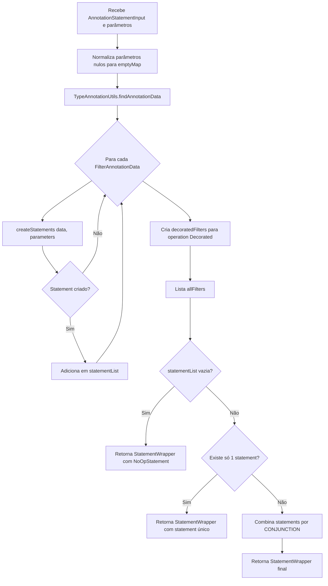
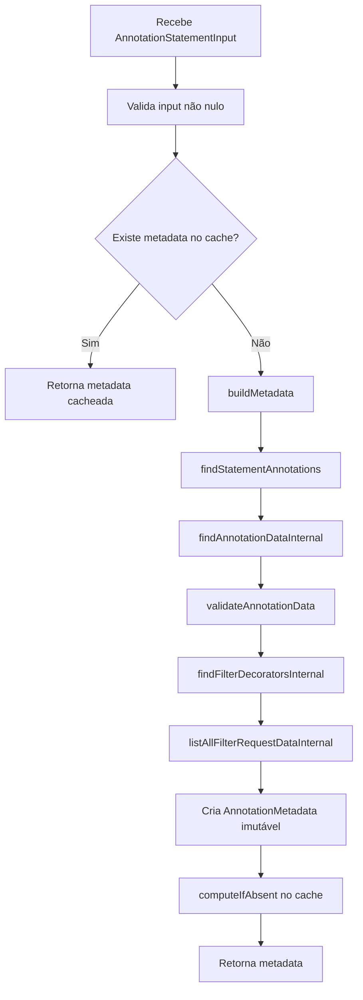
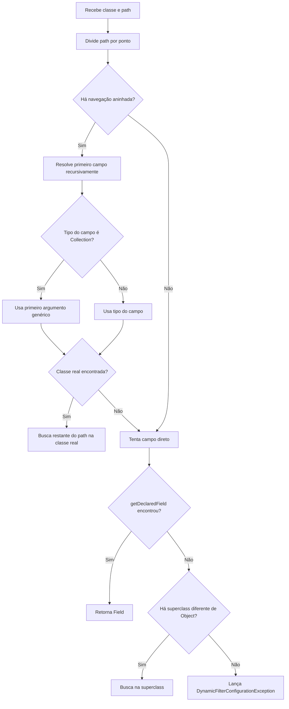

# Core, Fluxos Operacionais

> Spec operacional gerada pelo Reversa Writer em 2026-05-16.
> Escala de confiança: 🟢 CONFIRMADO, 🟡 INFERIDO, 🔴 LACUNA.

## Fluxo 1 — Gerar `StatementWrapper` a partir de annotations

🟢 **CONFIRMADO** — Este é o fluxo principal da unit `core`, executado por `AnnotationStatementGenerator.generateStatements`.



### Contrato do Fluxo

| Etapa | Entrada | Saída | Regra | Confiança |
|---|---|---|---|---|
| Normalização | `filterParameters` possivelmente nulo | `Map<String, Object>` não nulo | Nulo vira `Collections.emptyMap()`. | 🟢 |
| Extração | `AnnotationStatementInput` | `List<FilterAnnotationData>` | Usa metadata cacheada por `TypeAnnotationUtils`. | 🟢 |
| Processamento | `FilterAnnotationData` + parâmetros | `AbstractStatement` ou ausência | Filtros aplicáveis viram statements; ausentes não obrigatórios podem ser omitidos. | 🟢 |
| Decorados | Metadata e filtros | `Map<String, FilterData>` | Operação `Decorated` é separada em `decoratedFilters`. | 🟢 |
| Catálogo | Metadata | `List<FilterRequestData>` | Lista todos os filtros requisitáveis para adaptadores. | 🟢 |
| Resultado vazio | `statementList` vazia | `NoOpStatement` | Ausência de filtros aplicáveis é representada explicitamente. | 🟢 |
| Resultado múltiplo | `statementList` com 2+ items | `CompoundStatement` raiz | Statements raiz são combinados por `CONJUNCTION`. | 🟢 |

## Fluxo 2 — Computar `FilterData` e operação dinâmica

🟢 **CONFIRMADO** — `DefaultStatementGenerator.createFilterData` centraliza a tradução de valores resolvidos em `FilterData` operacional.

```mermaid
flowchart TD
    A[Recebe path, parameters, operation, negateParameter e values] --> B{operation == Dynamic?}
    B -- Não --> C[computeNegatingParameter]
    C --> D[comparisonValue = values]
    D --> Z[Cria FilterData]
    B -- Sim --> E{values[0] é Object[]?}
    E -- Não --> X1[Lança StatementGenerationException]
    E -- Sim --> F[Extrai primeiro item como código da operação]
    F --> G{primeiro item é String?}
    G -- Não --> X2[Lança StatementGenerationException]
    G -- Sim --> H{código tem tamanho 3?}
    H -- Sim --> I{primeiro char é N/n?}
    I -- Não --> X3[Lança StatementGenerationException]
    I -- Sim --> J[negate=true; resolve operação pelo restante]
    H -- Não --> K{código tem tamanho 2?}
    K -- Sim --> L[negate=false; resolve operação]
    K -- Não --> X4[Lança StatementGenerationException]
    J --> M[comparisonValue = valores restantes]
    L --> M
    M --> N{operação IN e primeiro valor não é array?}
    N -- Sim --> O[Empacota valores em array único]
    N -- Não --> P{operação BT?}
    O --> Z
    P -- Sim --> Q{há exatamente 2 valores?}
    Q -- Não --> X5[Lança StatementGenerationException]
    Q -- Sim --> R[Renomeia parâmetros para From/To]
    R --> Z
    P -- Não --> Z
```

### Códigos Dinâmicos

| Código | Operação | Ajuste especial | Confiança |
|---|---|---|---|
| `EQ` | `Equals` | Nenhum. | 🟢 |
| `LT` | `Less` | Nenhum. | 🟢 |
| `LE` | `LessOrEquals` | Nenhum. | 🟢 |
| `GT` | `Greater` | Nenhum. | 🟢 |
| `GE` | `GreaterOrEquals` | Nenhum. | 🟢 |
| `LK` | `Like` | Nenhum no core; execução concreta fica no adaptador. | 🟢 |
| `SW` | `StartsWith` | Nenhum no core. | 🟢 |
| `EW` | `EndsWith` | Nenhum no core. | 🟢 |
| `IN` | `IsIn` | Empacota múltiplos valores em array único quando necessário. | 🟢 |
| `BT` | `Between` | Exige dois valores e renomeia parâmetros para `From`/`To`. | 🟢 |
| `Nxx` | Operação negada | Prefixo `N`/`n` remove prefixo e marca `negate=true`. | 🟢 |

## Fluxo 3 — Resolver valores efetivos do filtro

🟢 **CONFIRMADO** — `DefaultStatementGenerator.computeValues` define a precedência operacional dos valores.

```mermaid
flowchart TD
    A[Recebe parameters, defaultValues, constantValues, parametersMap] --> B[Valida parameters não vazio]
    B --> C[Valida tamanhos de defaultValues e constantValues]
    C --> D{constantValues existe?}
    D -- Sim --> E[Usa constantValues]
    D -- Não --> F{Para cada parameter}
    F --> G{parametersMap contém chave?}
    G -- Sim --> H[Usa valor enviado]
    G -- Não --> I{Existe default correspondente?}
    I -- Sim --> J[Usa defaultValue]
    I -- Não --> K[Sem valor aplicável]
    E --> L[Aplica ValueExpressionResolver quando cabível]
    H --> L
    J --> L
    L --> M[Retorna Object[] de valores]
```

### Precedência

| Prioridade | Fonte | Comportamento | Confiança |
|---:|---|---|---|
| 1 | `constantValues` | Ignora parâmetros do usuário e defaults. | 🟢 |
| 2 | `parametersMap` | Usa valor recebido quando a chave existe. | 🟢 |
| 3 | `defaultValues` | Usa default quando a chave não existe. | 🟢 |
| 4 | Ausência | Filtro pode ser omitido ou falhar se obrigatório. | 🟢 |

## Fluxo 4 — Extrair e cachear metadata

🟢 **CONFIRMADO** — `TypeAnnotationUtils` evita recomputar metadata para entradas equivalentes.



### Regras de Metadata

| Regra | Evidência | Confiança |
|---|---|---|
| Cache usa `AnnotationStatementInput` como chave. | `AnnotationStatementInput` clona annotations e pré-calcula hash. | 🟢 |
| Limite default é `4096`. | `TypeAnnotationUtils` usa Caffeine com propriedade de override. | 🟢 |
| Interfaces não-`java.*` e superclasses participam da descoberta. | `findStatementAnnotations`. | 🟢 |
| Meta-annotations de `java.lang.annotation` são ignoradas. | `getAllAnnotations`. | 🟢 |
| Metadata inclui statements, decorators e filtros requisitáveis. | `buildMetadata`. | 🟢 |

## Fluxo 5 — Resolver field por path

🟢 **CONFIRMADO** — `TypeAnnotationUtils.findFilterField` resolve paths simples e aninhados usados por validação e OpenAPI.



### Lacunas do Fluxo

- 🔴 **LACUNA** — Não foi validado como o fluxo se comporta quando uma collection é raw e não possui `ParameterizedType`.
- 🔴 **LACUNA** — Não foi validado como o fluxo se comporta quando o primeiro argumento genérico é wildcard ou type variable, não `Class<?>`.
- 🟡 **INFERIDO** — Para reimplementação fiel, o comportamento seguro é preservar a falha explícita em vez de inferir tipo silenciosamente quando a classe real não puder ser materializada.

## Relação com Critérios de Aceitação

| Critério em `requirements.md` | Fluxo correspondente | Confiança |
|---|---|---|
| Gerar statement com filtro aplicável | Fluxo 1, Fluxo 2, Fluxo 3 | 🟢 |
| Gerar `NoOpStatement` sem filtros aplicáveis | Fluxo 1 | 🟢 |
| Rejeitar filtro obrigatório ausente | Fluxo 1, Fluxo 3 | 🟢 |
| Aplicar `constantValues` acima de parâmetros do usuário | Fluxo 3 | 🟢 |
| Resolver operação dinâmica positiva | Fluxo 2 | 🟢 |
| Rejeitar operação dinâmica `BT` inválida | Fluxo 2 | 🟢 |
| Compor decorators sem aceitar retorno nulo | Fluxo de decorators documentado em `design.md`; detalhamento fica em `decisions.md`. | 🟢 |
