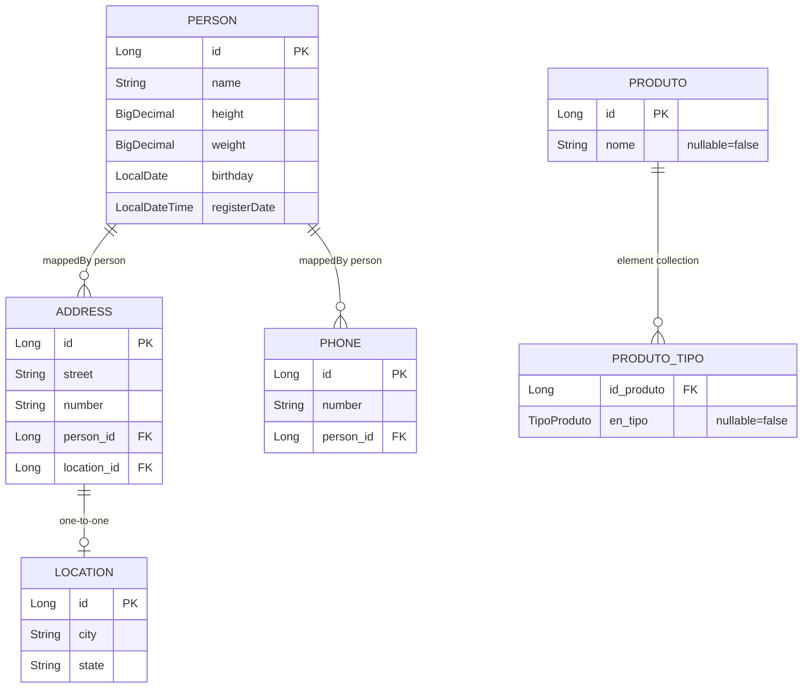

# ERD Completo — dynamic-filter-resolver

> Gerado pelo Reversa Architect em 2026-05-16.
> Escala de confiança: 🟢 CONFIRMADO, 🟡 INFERIDO, 🔴 LACUNA.

## Escopo

🟢 **CONFIRMADO** — Não há entidades JPA de produção no módulo. O ERD abaixo representa fixtures de teste localizadas em `src/test/java/com/runestone/dynafilter/modules/jpa/tools/app/database/jpamodels/`.

🟢 **CONFIRMADO** — As fixtures são usadas para validar resolução de paths, joins, fetch joins, predicates e `@ElementCollection` em testes/benchmarks.

🔴 **LACUNA** — Não há DDL, migrations ou schema produtivo versionado no módulo.

## Diagrama ERD

## Entidades

| Entidade | Tabela | Campos principais | Relacionamentos | Confiança |
|---|---|---|---|---|
| `Person` | default JPA (`person`) | `id`, `name`, `height`, `weight`, `birthday`, `registerDate` | `1:N` com `Address`; `1:N` com `Phone`. | 🟢 |
| `Address` | default JPA (`address`) | `id`, `street`, `number` | `N:1` com `Person`; `1:0..1` com `Location`. | 🟢 |
| `Phone` | default JPA (`phone`) | `id`, `number` | `N:1` com `Person`. | 🟢 |
| `Location` | default JPA (`location`) | `id`, `city`, `state` | Referenciada por `Address`. | 🟢 |
| `Produto` | `produto` | `id`, `nome` | `1:N` com collection table `produto_tipo`. | 🟢 |
| `TipoProduto` | N/A | `ELETRONICO`, `ALIMENTICIO`, `VESTUARIO`, `SERVICO` | Enum armazenado em `produto_tipo.en_tipo`. | 🟢 |

## Relacionamentos

| Origem | Destino | Cardinalidade | Mapeamento | Confiança |
|---|---|---|---|---|
| `Person.addresses` | `Address.person` | `1:N` | `@OneToMany(cascade = ALL, orphanRemoval = true, mappedBy = "person")` / `@ManyToOne @JoinColumn`. | 🟢 |
| `Person.phones` | `Phone.person` | `1:N` | `@OneToMany(cascade = ALL, orphanRemoval = true, mappedBy = "person")` / `@ManyToOne @JoinColumn`. | 🟢 |
| `Address.location` | `Location` | `1:0..1` | `@OneToOne @JoinColumn`. | 🟢 |
| `Produto.tipos` | `produto_tipo` | `1:N` | `@ElementCollection(fetch = LAZY)`, `@CollectionTable(name = "produto_tipo", joinColumns = @JoinColumn(name = "id_produto"))`. | 🟢 |

## Observações de Uso nos Testes

🟢 **CONFIRMADO** — `Person`, `Address`, `Phone` e `Location` exercitam paths simples e aninhados como `addresses.location` e fetch joins.

🟢 **CONFIRMADO** — `Produto.tipos` exercita `SpecificationIsIn` sobre `@ElementCollection`, com join no segmento final e `distinct(true)`.

🟢 **CONFIRMADO** — Todos os `id` usam `@GeneratedValue(strategy = GenerationType.IDENTITY)` nas entidades lidas.

🔴 **LACUNA** — Nomes físicos default das tabelas `Person`, `Address`, `Phone` e `Location` dependem da estratégia de naming do provider JPA/test context, pois `@Table` não define `name` nesses casos.
