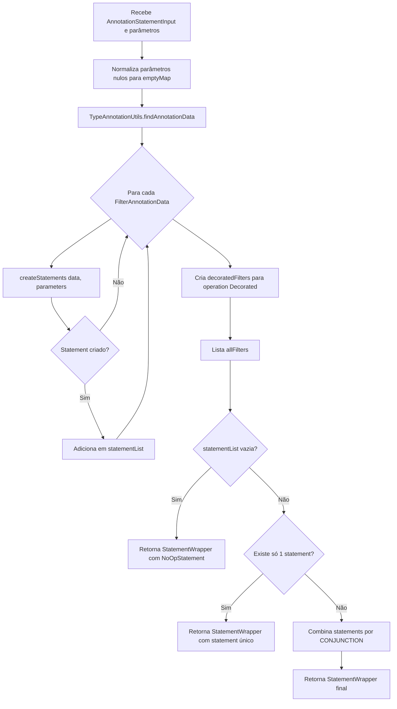
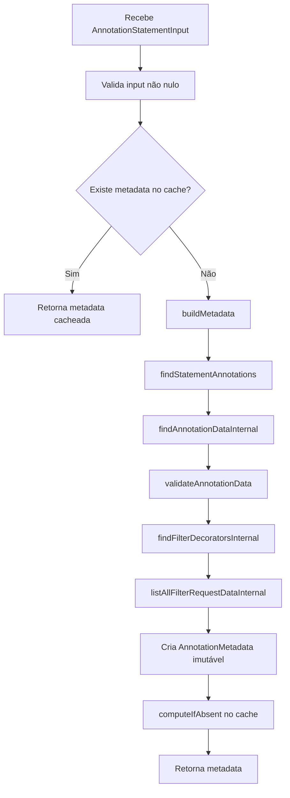
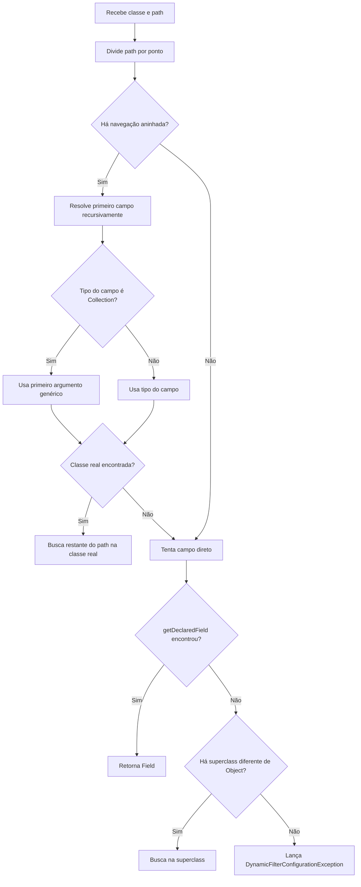

# Fluxogramas — Módulo `core`

> Gerado pelo Reversa Archaeologist em 2026-05-16.

## `AnnotationStatementGenerator.generateStatements`



## `DefaultStatementGenerator.createFilterData`

```mermaid
flowchart TD
    A[Recebe path, parameters, operation, negateParameter e values] --> B{operation == Dynamic?}
    B -- Não --> C[computeNegatingParameter]
    C --> D[comparisonValue = values]
    D --> Z[Cria FilterData]
    B -- Sim --> E{values[0] é Object[]?}
    E -- Não --> X1[Lança StatementGenerationException]
    E -- Sim --> F[Extrai primeiro item como código da operação]
    F --> G{primeiro item é String?}
    G -- Não --> X2[Lança StatementGenerationException]
    G -- Sim --> H{código tem tamanho 3?}
    H -- Sim --> I{primeiro char é N/n?}
    I -- Não --> X3[Lança StatementGenerationException]
    I -- Sim --> J[negate=true; resolve operação pelo restante]
    H -- Não --> K{código tem tamanho 2?}
    K -- Sim --> L[negate=false; resolve operação]
    K -- Não --> X4[Lança StatementGenerationException]
    J --> M[comparisonValue = valores restantes]
    L --> M
    M --> N{operação IN e primeiro valor não é array?}
    N -- Sim --> O[Empacota valores em array único]
    N -- Não --> P{operação BT?}
    O --> Z
    P -- Sim --> Q{há exatamente 2 valores?}
    Q -- Não --> X5[Lança StatementGenerationException]
    Q -- Sim --> R[Renomeia parâmetros para From/To]
    R --> Z
    P -- Não --> Z
```

## `TypeAnnotationUtils.findCachedMetadata`



## `TypeAnnotationUtils.findFilterField`


