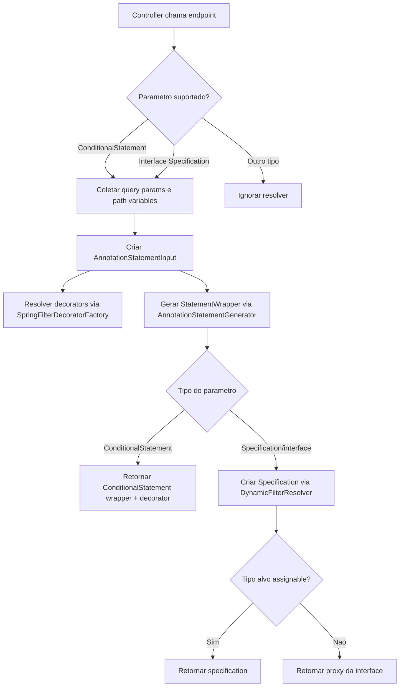
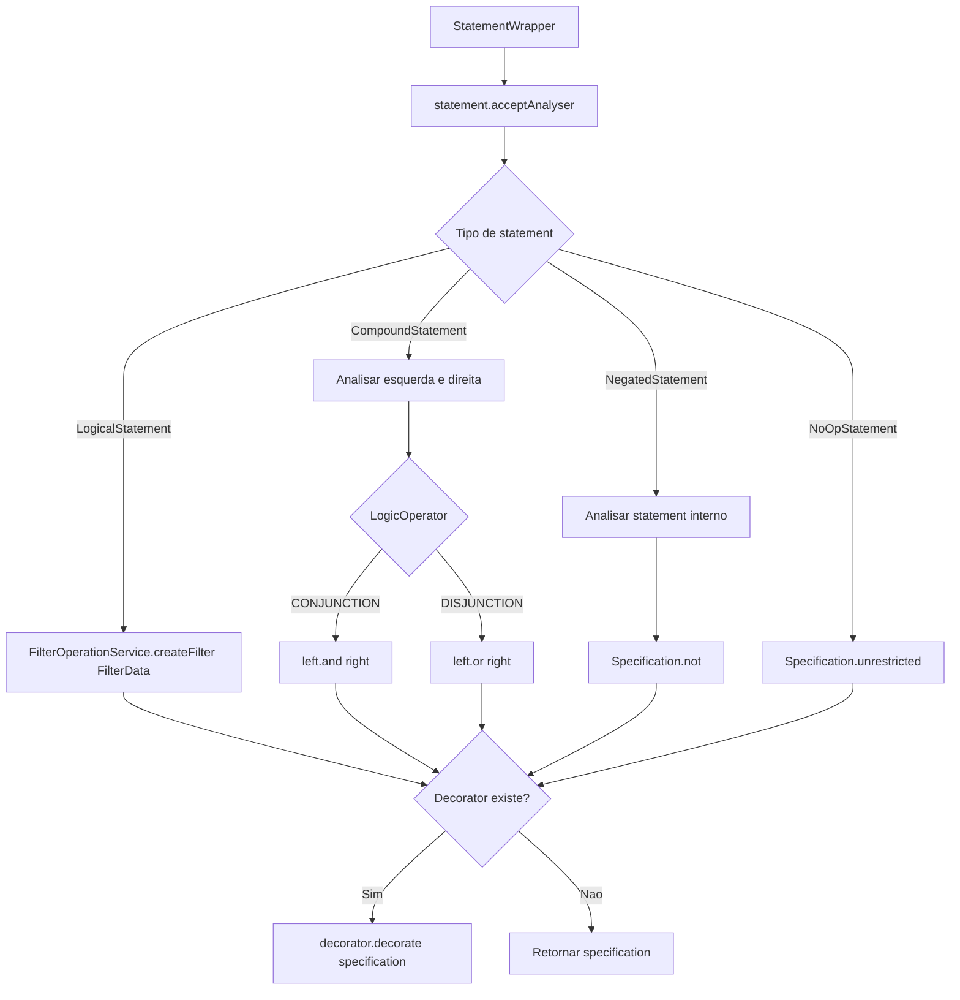
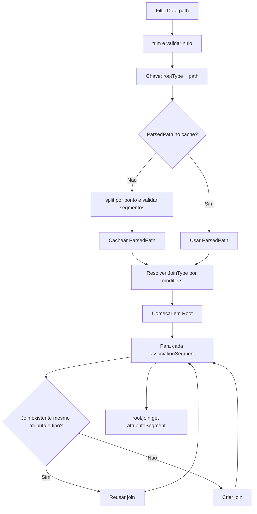
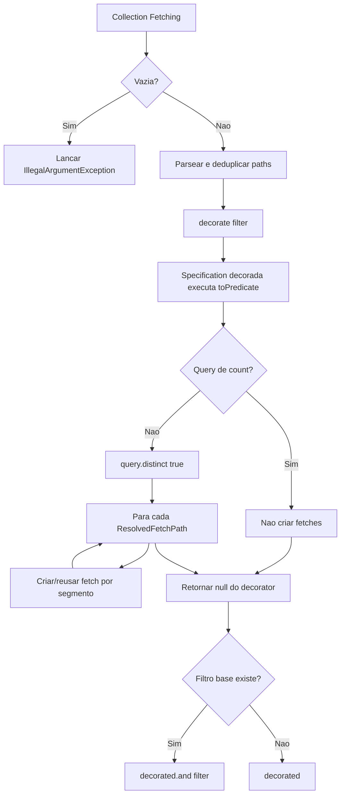
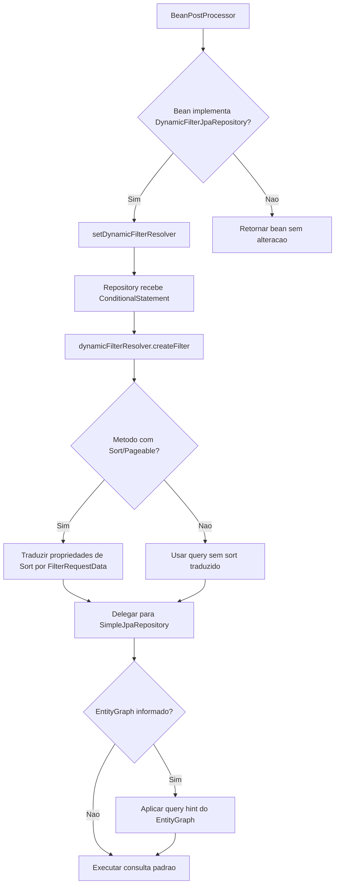

# Fluxogramas — Módulo `modules.jpa`

> Gerado pelo Reversa Archaeologist em 2026-05-16.
> Escala de confiança: 🟢 CONFIRMADO, 🟡 INFERIDO, 🔴 LACUNA.

## Resolução MVC para Specification

🟢 CONFIRMADO

## StatementWrapper para Specification JPA

🟢 CONFIRMADO

## Criação de Path e Join no Criteria API

🟢 CONFIRMADO

## FetchingFilterDecorator

🟢 CONFIRMADO

## Repository Dinâmico

🟢 CONFIRMADO

