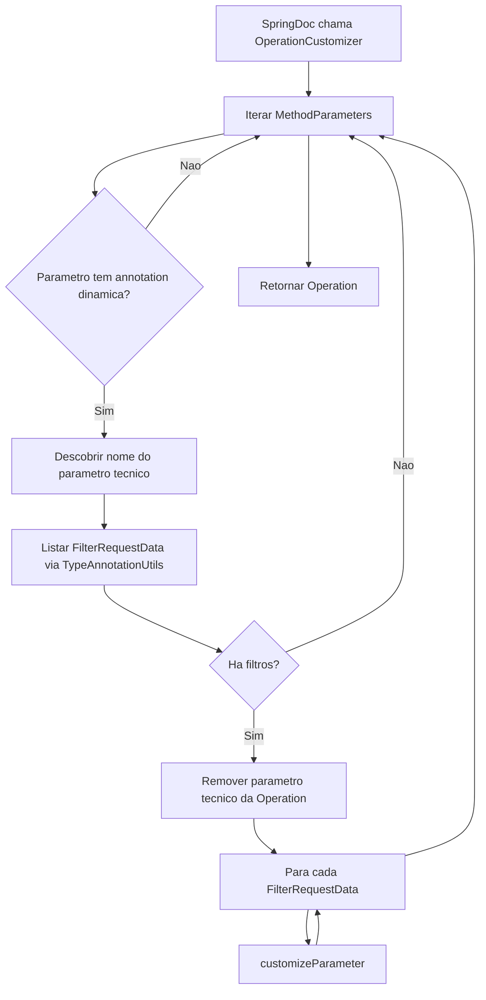
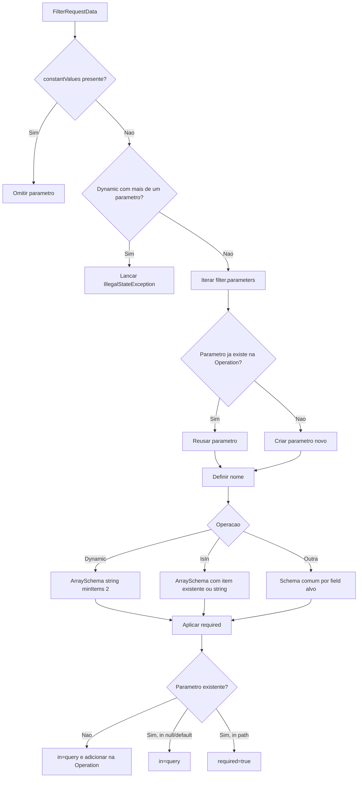
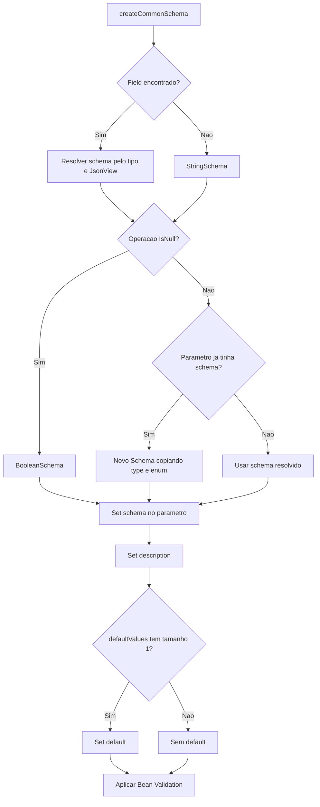
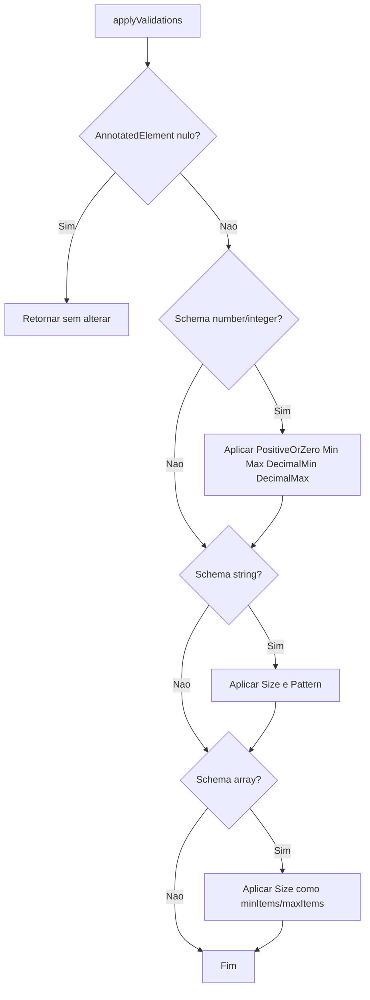

# Fluxogramas — Módulo `modules.openapi`

> Gerado pelo Reversa Archaeologist em 2026-05-16.
> Escala de confiança: 🟢 CONFIRMADO, 🟡 INFERIDO, 🔴 LACUNA.

## Customização de Operação OpenAPI

🟢 CONFIRMADO

## Criação de Parâmetro por Filtro

🟢 CONFIRMADO

## Schema Comum e Validações

🟢 CONFIRMADO

## Bean Validation para OpenAPI Schema

🟢 CONFIRMADO

