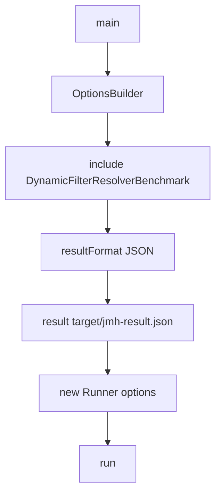
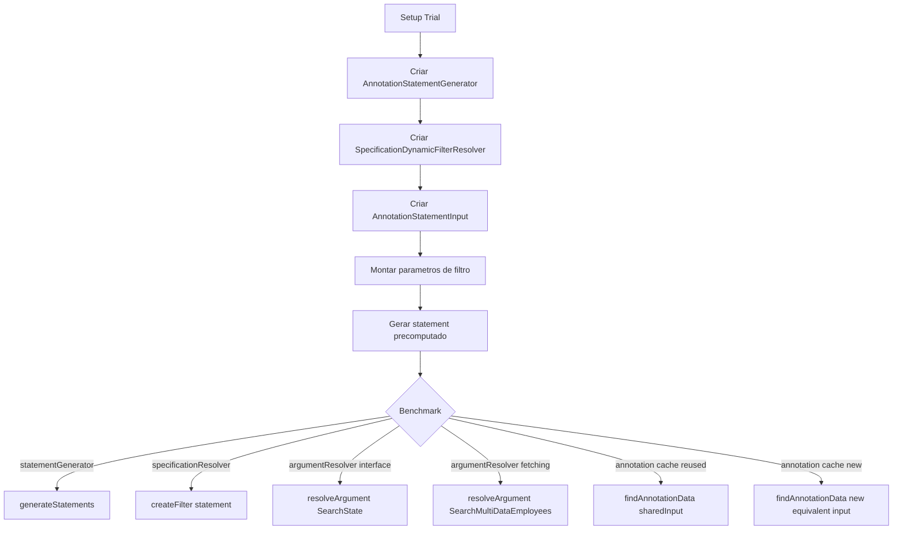
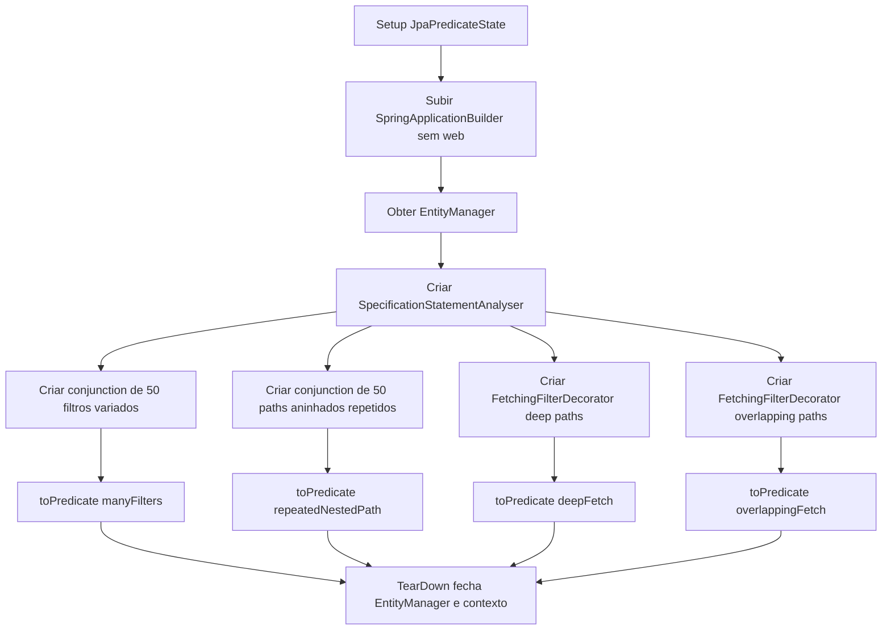
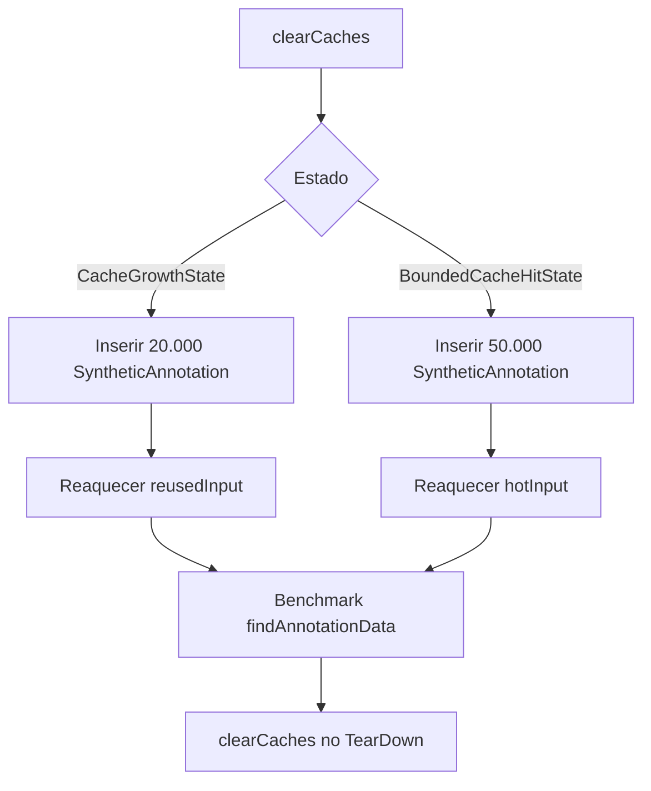
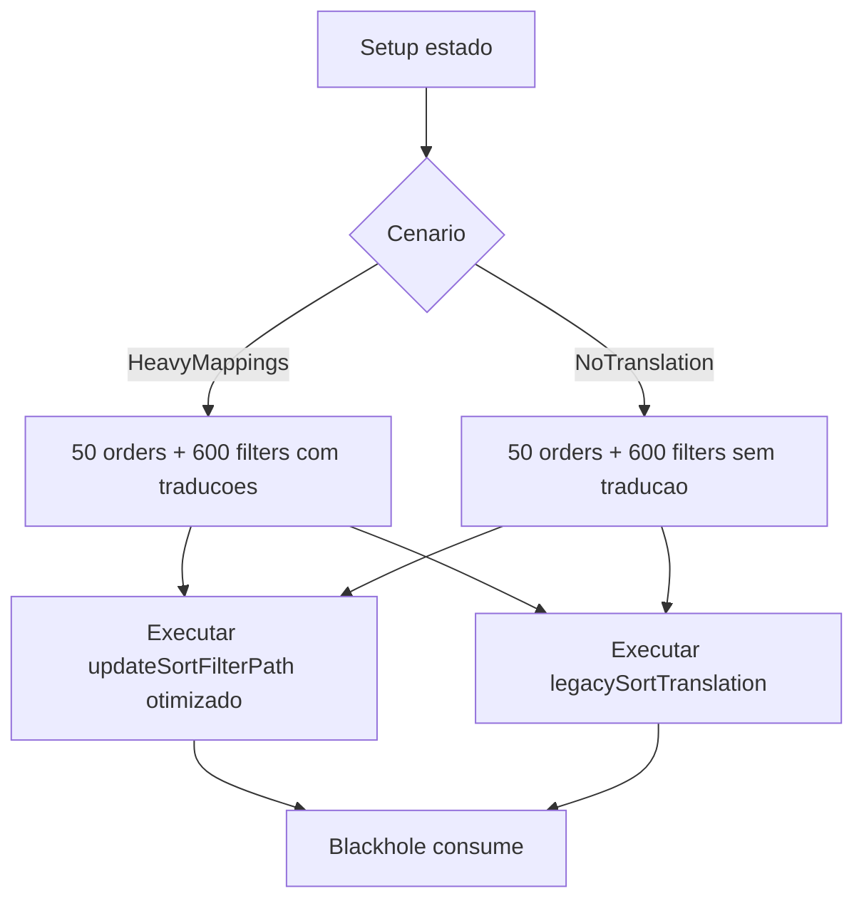

# Fluxogramas — Módulo `test-support.performance`

> Gerado pelo Reversa Archaeologist em 2026-05-16.
> Escala de confiança: 🟢 CONFIRMADO, 🟡 INFERIDO, 🔴 LACUNA.

## Runner JMH

🟢 CONFIRMADO

## Benchmark Geral do Resolver

🟢 CONFIRMADO

## Perf02 Criteria e Cache

🟢 CONFIRMADO

## Cache Growth Benchmarks

🟢 CONFIRMADO

## Sort Translation Benchmark

🟢 CONFIRMADO

