# Modules JPA, Design Técnico

> Spec operacional gerada pelo Reversa Writer em 2026-05-16.
> Escala de confiança: 🟢 CONFIRMADO, 🟡 INFERIDO, 🔴 LACUNA.

## Interface

| Símbolo | Assinatura | Retorno | Observação |
|---------|-----------|---------|------------|
| `SpecificationDynamicFilterResolver.createFilter` | `(StatementWrapper, FilterDecorator<Specification<?>>)` | `R extends Specification<?>` | 🟢 Converte árvore core em Specification e aplica decorator opcional. |
| `SpecificationStatementAnalyser.analyse*` | `(AbstractStatement subtype)` | `Specification<?>` | 🟢 Traduz cada nó lógico. |
| `JpaPredicateUtils.computeAttributePath` | `(FilterData, Root<?>)` | `Path<T>` | 🟢 Resolve path simples/aninhado. |
| `JpaPredicateUtils.computeAttributeJoinPath` | `(FilterData, Root<?>)` | `Expression<T>` | 🟢 Usado para collections no segmento final. |
| `SpecificationDynamicFilterArgumentResolver.resolveArgument` | Spring MVC SPI | `Object` | 🟢 Retorna `ConditionalStatement`, `Specification` ou proxy. |
| `SpringFilterDecoratorFactory.createFilterDecorators` | `(AnnotationStatementInput)` | `FilterDecorator<Specification<?>>` | 🟢 Resolve fetching e decorators customizados. |
| `DynamicFilterJpaRepositoryImpl.updateSortFilterPath` | `(Sort, List<FilterRequestData>)` | `Sort` | 🟢 Traduz sort externo para path real. |

## Fluxo Principal

```mermaid
flowchart LR
    Request[Request MVC] --> ArgResolver[SpecificationDynamicFilterArgumentResolver]
    ArgResolver --> Generator[AnnotationStatementGenerator]
    Generator --> Wrapper[StatementWrapper]
    ArgResolver --> Decorators[SpringFilterDecoratorFactory]
    Wrapper --> Resolver[SpecificationDynamicFilterResolver]
    Decorators --> Resolver
    Resolver --> Analyser[SpecificationStatementAnalyser]
    Analyser --> OpService[SpecificationFilterOperationService]
    OpService --> Specs[Specification*]
    Specs --> Criteria[Criteria API Predicate]
    Resolver --> Repository[DynamicFilterJpaRepositoryImpl]
```

## Fluxos Alternativos

- 🟢 **`NoOpStatement`:** vira `Specification.unrestricted()`.
- 🟢 **`NegatedStatement`:** envolve specification com `Specification.not(...)`.
- 🟢 **Path simples:** usa `root.get(attribute)`.
- 🟢 **Path composto:** cria/reutiliza joins intermediários.
- 🟢 **Collection final em `IN`:** faz join no último segmento e marca `distinct(true)`.
- 🟢 **Count query com fetching:** `FetchingFilterDecorator` não cria fetch.
- 🟢 **Query normal com fetching:** cria fetch joins, deduplica paths e marca `distinct(true)`.
- 🟢 **Path variables:** são mescladas depois de query parameters, podendo sobrescrever chaves iguais.
- 🟢 **Proxy customizado:** contrato de reconstrução confirmado pelo usuário limita suporte ao uso essencial de `Specification`, especialmente `toPredicate`; default methods e métodos de `Object` ficam fora do contrato obrigatório.

## Dependências

- 🟢 `core`: `StatementWrapper`, statements, annotations, `FilterData`, `FilterRequestData`, `FilterDecorator`.
- 🟢 Spring Data JPA: `Specification`, `JpaRepository`, `SimpleJpaRepository`.
- 🟢 Jakarta Persistence Criteria API: `Root`, `Path`, `Join`, `CriteriaBuilder`, `Predicate`.
- 🟢 Spring MVC: `HandlerMethodArgumentResolver`, `NativeWebRequest`, `WebMvcConfigurer`.
- 🟢 Spring context: `GenericApplicationContext`, bean lookup/registration.
- 🟢 runestone-toolkit: `DataConversionService`.
- 🟢 Caffeine: cache de path parseado.

## Decisões de Design Identificadas

| Decisão | Evidência | Confiança |
|---------|----------|-----------|
| Traduzir árvore core por visitor/analyser para `Specification`. | `SpecificationStatementAnalyser.java` | 🟢 |
| Usar `INNER` como join type padrão. | ADR 003, `JpaPredicateUtils` | 🟢 |
| Marcar `distinct(true)` em collection final e fetch joins. | `SpecificationIsIn.java`, `FetchingFilterDecorator.java` | 🟢 |
| Resolver decorators via Spring e cachear por input. | `SpringFilterDecoratorFactory.java` | 🟢 |
| Injetar resolver em repositories por BeanPostProcessor. | `DynamicFilterJpaRepositoryBeanPostProcessor.java` | 🟢 |
| Validar filtros em warmup de controllers. | `FilterConfigurationAnalyserBeanPostProcessor.java` | 🟢 |

## Estado Interno

| Estado | Local | Evolução | Confiança |
|---|---|---|---|
| Cache de path parseado | `JpaPredicateUtils` | Preenchido por path textual e limitado por Caffeine. | 🟢 |
| Cache de decorators por input | `SpringFilterDecoratorFactory.decoratorCache` | Guarda presença/ausência de decorators por `AnnotationStatementInput`. | 🟢 |
| Cache de decorators por classe | `SpringFilterDecoratorFactory.decoratorsByClass` | Reusa beans ou classes registradas no contexto Spring. | 🟢 |
| Resolver injetado | `DynamicFilterJpaRepositoryImpl.dynamicFilterResolver` | Inicialmente nulo; preenchido por BPP no uso Spring esperado; uso sem resolver deve falhar com erro explícito. | 🟢 |

## Observabilidade

🔴 **LACUNA** — Não há logs/métricas/traces próprios documentados na unit.

🟢 **CONFIRMADO** — Observabilidade comportamental vem dos testes de integração JPA, MVC e benchmarks JMH.

## Riscos e Lacunas

- 🟢 `DynamicFilterJpaRepositoryImpl` depende de injeção tardia do resolver; reconstrução deve falhar explicitamente se o resolver estiver ausente.
- 🟢 Proxy de interface `Specification` tem contrato limitado a `toPredicate`; default methods/Object methods ficam fora do escopo obrigatório.
- 🟢 Método público `convertoToSpecification` possui typo e deve ser preservado por compatibilidade.
