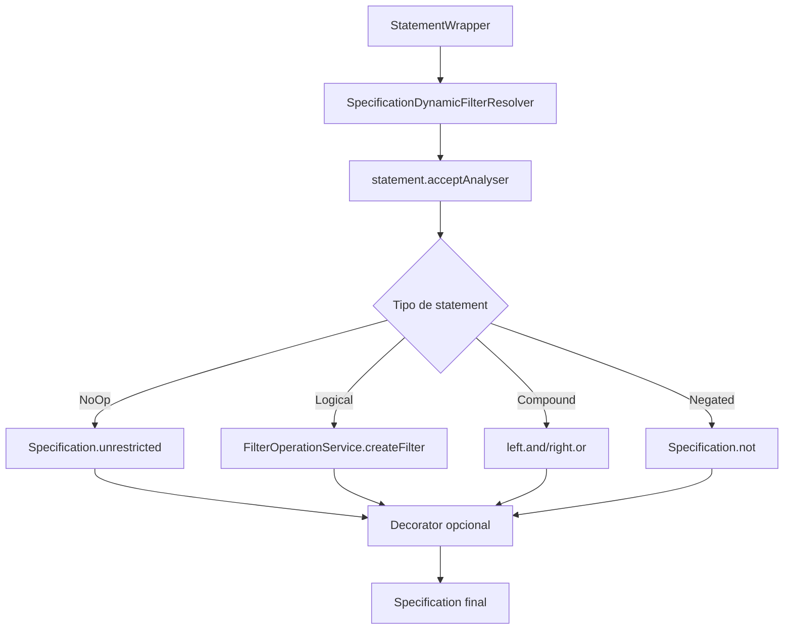
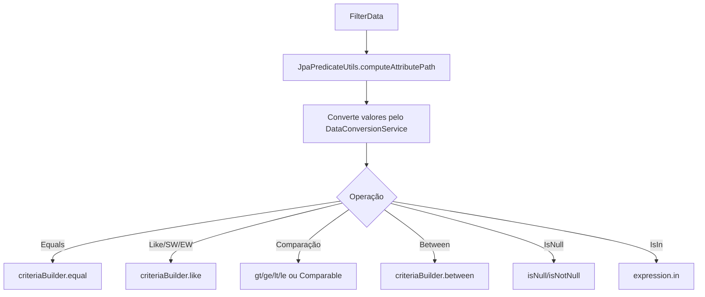
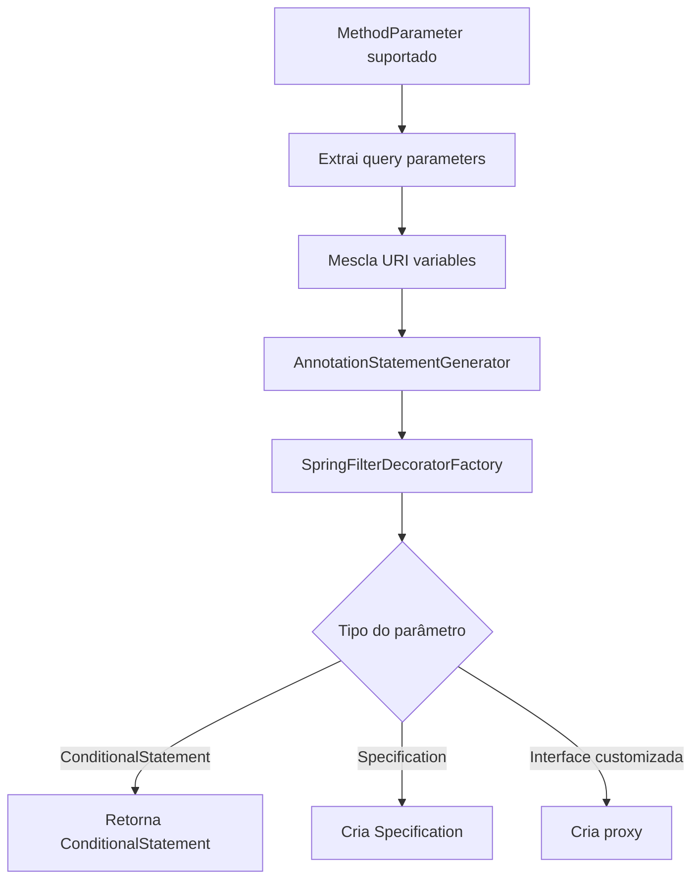
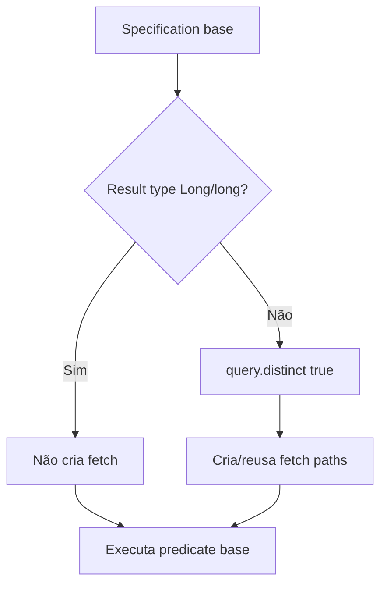
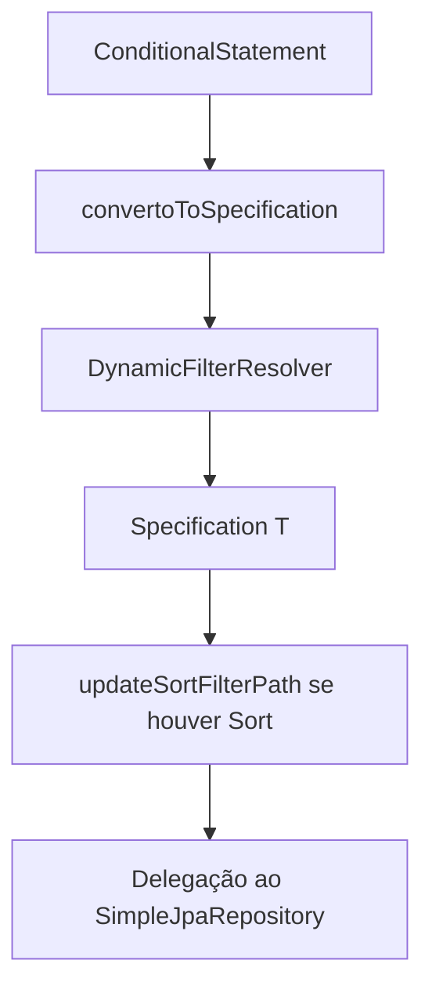

# Modules JPA, Fluxos Operacionais

> Spec operacional gerada pelo Reversa Writer em 2026-05-16.
> Escala de confiança: 🟢 CONFIRMADO, 🟡 INFERIDO, 🔴 LACUNA.

## Fluxo 1 — Statement para Specification

## Fluxo 2 — Predicate Criteria

## Fluxo 3 — Argument Resolver MVC

## Fluxo 4 — Fetch Decorator

## Fluxo 5 — Repository Dinâmico

## Casos de Erro

- 🟢 Sem `HttpServletRequest` no `NativeWebRequest` gera `IllegalStateException`.
- 🟢 Path inválido em Criteria ou fetching falha explicitamente.
- 🟢 Operation sem implementação é rejeitada no serviço do core.
- 🟢 Proxy customizado tem contrato limitado a `toPredicate`; default methods/Object methods ficam fora do escopo obrigatório conforme decisão do usuário.
