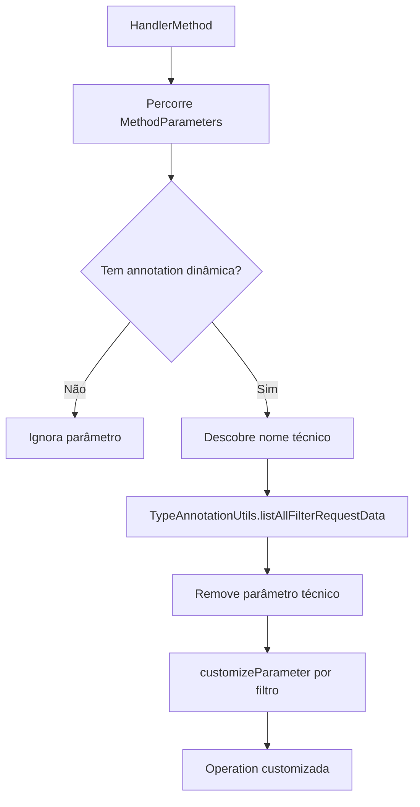

# Modules OpenAPI, Design Técnico

> Spec operacional gerada pelo Reversa Writer em 2026-05-16.
> Escala de confiança: 🟢 CONFIRMADO, 🟡 INFERIDO, 🔴 LACUNA.

## Interface

| Símbolo | Assinatura | Retorno | Observação |
|---------|-----------|---------|------------|
| `DynaFilterOperationCustomizer.customize` | `(Operation, HandlerMethod)` | `Operation` | 🟢 Percorre parâmetros do handler e customiza OpenAPI. |
| `DynaFilterOperationCustomizer.customizeParameter` | `(Operation, MethodParameter, FilterRequestData)` | `void` | 🟢 Cria/atualiza parâmetros OpenAPI por filtro. |
| `DynaFilterOperationCustomizer.createCommonSchema` | `(FilterRequestData, Field, MethodParameter, Parameter)` | `void` | 🟢 Resolve schema, descrição, default e validações. |
| `SchemaValidationUtils.applyValidations` | `(Schema<?>, AnnotatedElement)` | `void` | 🟢 Copia Bean Validation para schema. |

## Fluxo Principal

## Fluxos Alternativos

- 🟢 **Filtro constante:** `customizeParameter` retorna sem criar parâmetro.
- 🟢 **`Dynamic`:** exige parâmetro único e cria `ArraySchema` de `StringSchema` com `minItems=2`.
- 🟢 **`IsIn`:** cria `ArraySchema` e preserva schema existente como item quando houver.
- 🟢 **`IsNull`:** usa `BooleanSchema`.
- 🟢 **Field não encontrado:** usa `StringSchema` fallback.
- 🟢 **Parâmetro existente `path`:** mantém `path` e força required.
- 🟢 **`@DisjunctionFrom` isolado:** a condição inicial não reconhece esse caso por duplicidade de `Disjunction.class` e ausência de `DisjunctionFrom.class` (`DynaFilterOperationCustomizer.java:63-64`).

## Dependências

- 🟢 `core`: `TypeAnnotationUtils`, `FilterRequestData`, annotations e operations.
- 🟢 SpringDoc OpenAPI: `OperationCustomizer`, `Operation`, `Parameter`, `Schema`, `ArraySchema`.
- 🟢 Jackson `JsonView`: usado ao resolver schema do tipo.
- 🟢 Jakarta Bean Validation: fonte de constraints.
- 🟢 Spring `AnnotationUtils`: detecta constraints diretas e compostas.

## Decisões de Design

| Decisão | Evidência | Confiança |
|---|---|---|
| Remover parâmetro técnico e documentar somente entradas reais. | `DynaFilterOperationCustomizer.customize` | 🟢 |
| Não documentar constantes. | `DynaFilterOperationCustomizer.customizeParameter` | 🟢 |
| Modelar `Dynamic` como array string. | `DynaFilterOperationCustomizer` | 🟢 |
| Propagar Bean Validation para OpenAPI. | `SchemaValidationUtils` | 🟢 |

## Estado Interno

🟢 **CONFIRMADO** — `DynaFilterOperationCustomizer` mantém apenas dependência opcional de `ParameterNameDiscoverer`.

🟢 **CONFIRMADO** — `SchemaValidationUtils` é utilitário stateless.

## Riscos

- 🟡 Baixa cobertura direta para `DynaFilterOperationCustomizer`.
- 🟢 **CONFIRMADO PELO USUÁRIO** — A reconstrução deve corrigir a não detecção de `@DisjunctionFrom` isolado, incluindo `DisjunctionFrom.class` na condição inicial.
