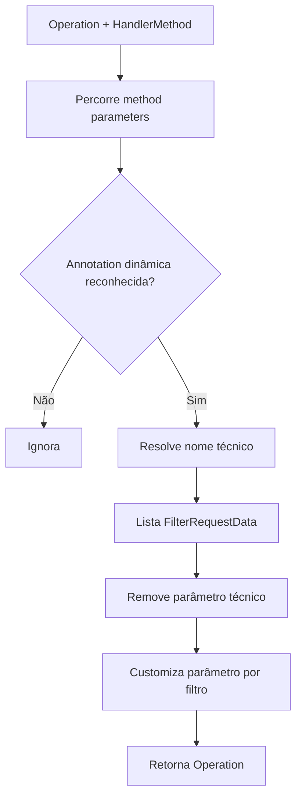
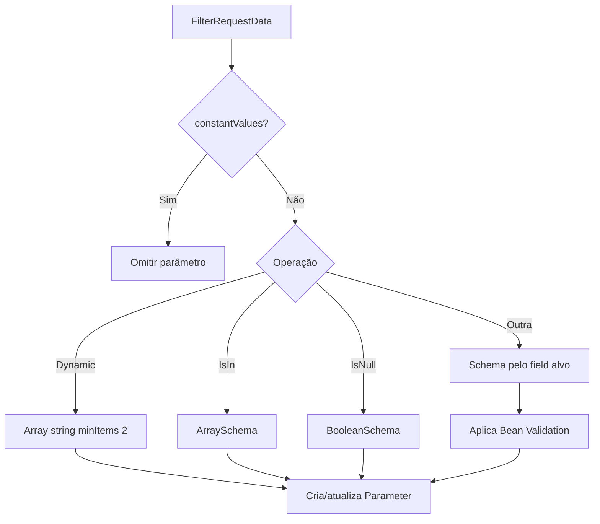
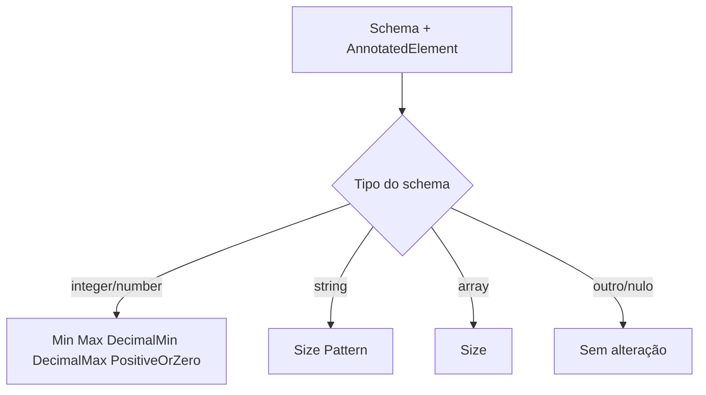

# Modules OpenAPI, Fluxos Operacionais

> Spec operacional gerada pelo Reversa Writer em 2026-05-16.
> Escala de confiança: 🟢 CONFIRMADO, 🟡 INFERIDO, 🔴 LACUNA.

## Fluxo 1 — Customização da Operação

## Fluxo 2 — Customização por Filtro

## Fluxo 3 — Bean Validation

## Casos de Falha

- 🟢 `Dynamic` com mais de um parâmetro gera `IllegalStateException`.
- 🟢 Falha na customização é encapsulada com informação do handler method.
- 🟢 `@DisjunctionFrom` isolado não entra no fluxo do customizer no legado porque a condição inicial não verifica `DisjunctionFrom.class` (`DynaFilterOperationCustomizer.java:63-64`).
