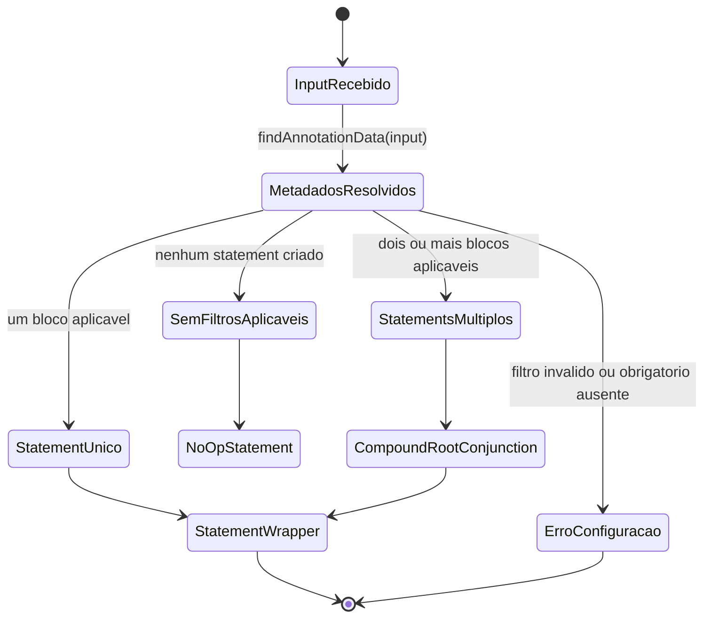
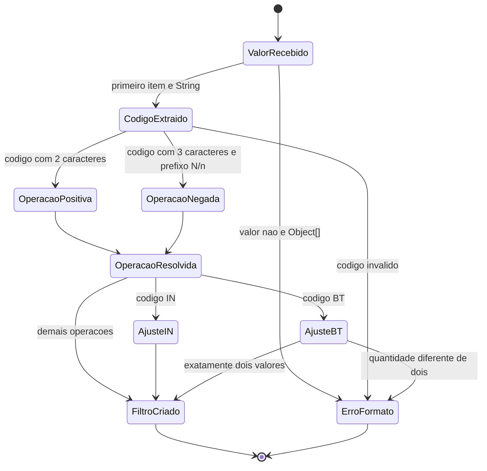
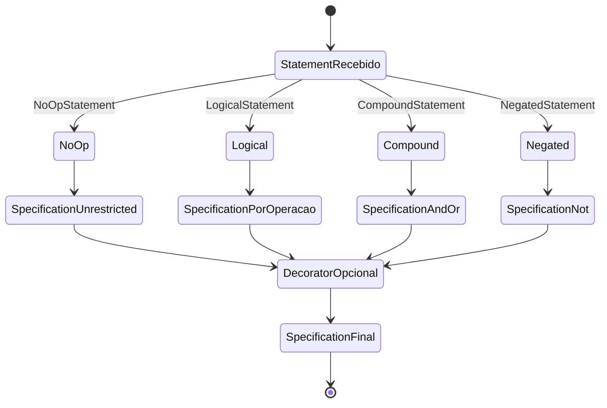
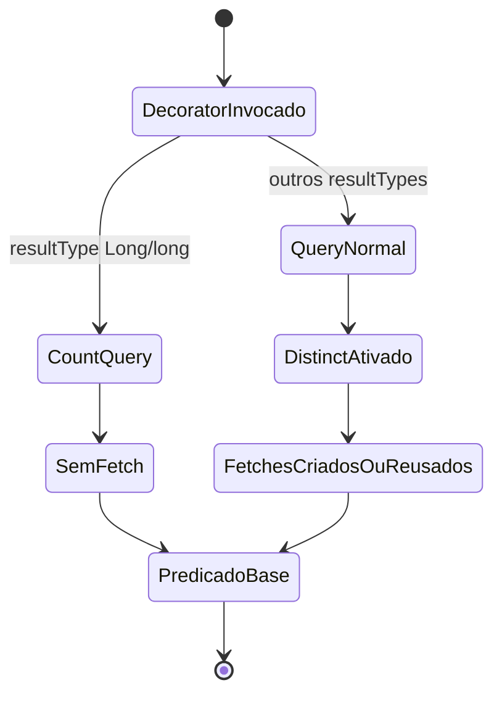
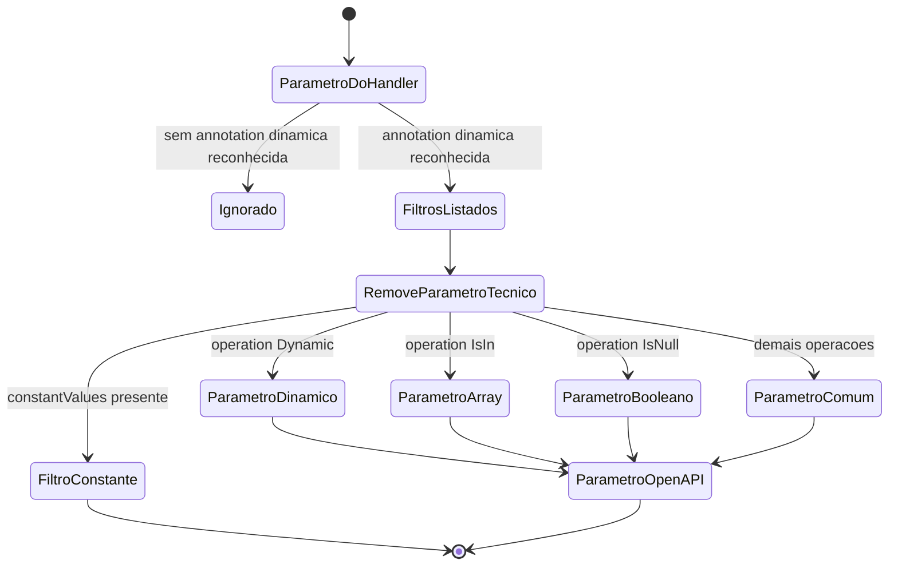

# Máquinas de Estado — dynamic-filter-resolver

> Gerado pelo Reversa Detective em 2026-05-16.
> Escala de confiança: 🟢 CONFIRMADO, 🟡 INFERIDO, 🔴 LACUNA.

## Sumário

🟢 **CONFIRMADO** — O módulo não possui entidades de negócio com campo `status` persistido em produção. Não há ciclo de vida de pedido, usuário, pagamento ou objeto equivalente.

🟡 **INFERIDO** — As máquinas de estado relevantes são técnicas e descrevem a evolução de artefatos internos: geração de statements, resolução de operação dinâmica e aplicação de filtros em JPA/OpenAPI.

## Máquina: Geração De Statement

🟢 **CONFIRMADO** — `AnnotationStatementGenerator.generateStatements` transforma annotations e parâmetros em `StatementWrapper`.

### Transições

| Origem | Destino | Gatilho | Confiança |
|---|---|---|---|
| `InputRecebido` | `MetadadosResolvidos` | Busca de metadados em `TypeAnnotationUtils.findAnnotationData`. | 🟢 |
| `MetadadosResolvidos` | `SemFiltrosAplicaveis` | Nenhum filtro com valor aplicável e nenhum obrigatório ausente. | 🟢 |
| `MetadadosResolvidos` | `StatementUnico` | Exatamente um bloco aplicável. | 🟢 |
| `MetadadosResolvidos` | `StatementsMultiplos` | Mais de um bloco aplicável. | 🟢 |
| `StatementsMultiplos` | `CompoundRootConjunction` | Blocos raiz são combinados por `LogicOperator.CONJUNCTION`. | 🟢 |
| `MetadadosResolvidos` | `ErroConfiguracao` | Parâmetro obrigatório ausente, operação dinâmica inválida ou metadados inconsistentes. | 🟢 |

## Máquina: Operação Dinâmica

🟢 **CONFIRMADO** — Quando `operation == Dynamic.class`, o primeiro valor enviado define a operação real.

### Estados Operacionais

| Estado | Descrição | Confiança |
|---|---|---|
| `OperacaoPositiva` | Resolve `EQ`, `LT`, `LE`, `GT`, `GE`, `LK`, `SW`, `EW`, `IN` ou `BT` sem negação. | 🟢 |
| `OperacaoNegada` | Remove prefixo `N`/`n`, resolve o código restante e marca `negate=true`. | 🟢 |
| `AjusteIN` | Agrupa valores múltiplos em array quando necessário. | 🟢 |
| `AjusteBT` | Exige dois valores e renomeia parâmetros para `<param>From` e `<param>To`. | 🟢 |

## Máquina: Resolução JPA

🟢 **CONFIRMADO** — A árvore de statements é visitada por `SpecificationStatementAnalyser` e vira `Specification<?>`.

### Transições Críticas

| Origem | Destino | Regra | Confiança |
|---|---|---|---|
| `NoOp` | `SpecificationUnrestricted` | Ausência de filtro deve preservar consulta irrestrita. | 🟢 |
| `Logical` | `SpecificationPorOperacao` | `FilterOperationService` escolhe implementação por `FilterData.operation`. | 🟢 |
| `Compound` | `SpecificationAndOr` | `LogicOperator.CONJUNCTION` vira `and`; `DISJUNCTION` vira `or`. | 🟢 |
| `Negated` | `SpecificationNot` | Usa `Specification.not(...)`. | 🟢 |
| `DecoratorOpcional` | `SpecificationFinal` | Decorator pode envolver a specification, por exemplo com fetch joins. | 🟢 |

## Máquina: Fetching JPA

🟢 **CONFIRMADO** — `FetchingFilterDecorator` altera comportamento conforme tipo da query.

### Regras

| Regra | Confiança |
|---|---|
| Count query não recebe fetch join. | 🟢 |
| Query normal recebe `distinct(true)`. | 🟢 |
| Paths iguais são deduplicados preservando ordem. | 🟢 |
| Fetch existente com mesmo atributo e join type é reutilizado. | 🟢 |

## Máquina: OpenAPI Expansion

🟢 **CONFIRMADO** — `DynaFilterOperationCustomizer` expande filtros em parâmetros documentados.

### Lacunas

🔴 **LACUNA** — Não há máquina de estado de permissões/autorização porque o módulo não contém autenticação, autorização, RBAC ou ACL.

🔴 **LACUNA** — Não há eventos de log suficientes para reconstruir estados operacionais em produção.
