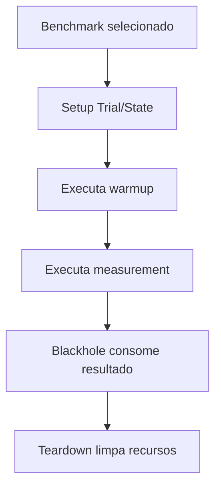

# Test Support Performance, Design Técnico

> Spec operacional gerada pelo Reversa Writer em 2026-05-16.
> Escala de confiança: 🟢 CONFIRMADO, 🟡 INFERIDO, 🔴 LACUNA.

## Interface

| Símbolo | Assinatura | Retorno | Observação |
|---|---|---|---|
| `DynamicFilterResolverBenchmarkRunner.main` | `(String[] args)` | `void` | 🟢 Executa JMH e grava JSON. |
| `DynamicFilterResolverBenchmark` | métodos `@Benchmark` | `void` | 🟢 Baseline em microssegundos. |
| `DynamicFilterResolverPerf02Benchmark` | métodos `@Benchmark` | `void` | 🟢 Criteria/fetch/cache sob Spring/H2. |
| `DynamicFilterResolverPerf06ProxyBenchmark` | métodos `@Benchmark` | `void` | 🟢 Proxy invocation. |
| `DynamicFilterRepositorySortPerfBenchmark` | métodos `@Benchmark` | `void` | 🟢 Sort translation. |

## Fluxo Principal

## Dependências

- 🟢 JMH `1.37`.
- 🟢 JUnit/Spring Test para fixtures.
- 🟢 H2 em memória para cenários JPA.
- 🟢 Mockito para mocks MVC/Criteria.
- 🟢 Classes de produção `core`, `modules.jpa` e repositories.

## Decisões de Design

| Decisão | Evidência | Confiança |
|---|---|---|
| Usar AverageTime em microssegundos. | Configurações JMH documentadas. | 🟢 |
| Usar Spring/H2 apenas em benchmarks que precisam de Criteria real. | `Perf02.JpaPredicateState` | 🟢 |
| Comparar algoritmo otimizado contra legado em sort translation. | `DynamicFilterRepositorySortPerfBenchmark` | 🟢 |
| Manter runner manual limitado ao baseline. | `DynamicFilterResolverBenchmarkRunner` | 🟡 |

## Estado Interno

| Estado | Conteúdo | Confiança |
|---|---|---|
| `StatementState` | Gerador, resolver, input, parâmetros e statement pré-computado. | 🟢 |
| `ArgumentResolverState` | Mocks MVC e request. | 🟢 |
| `JpaPredicateState` | Spring context, EntityManager e specifications pesadas. | 🟢 |
| `CacheGrowthState` | Cache preenchido com annotations sintéticas. | 🟢 |
| `ProxyInvocationState` | Proxies e mocks Criteria. | 🟢 |
| `HeavyMappingsState` | 50 orders e 600 filtros. | 🟢 |

## Riscos

- 🟡 Runner manual não inclui Perf02, Perf06 nem sort benchmark.
- 🟢 Benchmarks com reflection em método privado são sensíveis a mudança de assinatura.
