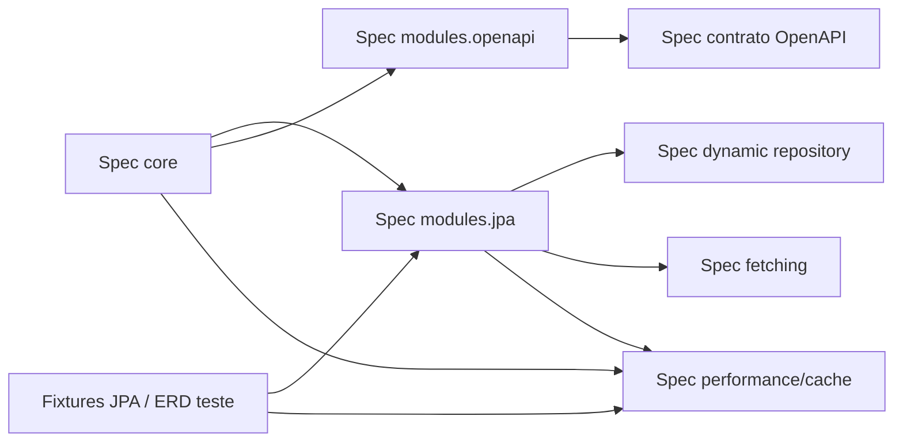

# Spec Impact Matrix — dynamic-filter-resolver

> Gerado pelo Reversa Architect em 2026-05-16.
> Escala de confiança: 🟢 CONFIRMADO, 🟡 INFERIDO, 🔴 LACUNA.

## Matriz por Componente

| Componente | Artefatos SDD impactados | Código fonte principal | Regras/decisões afetadas | Confiança |
|---|---|---|---|---|
| Annotation metadata | `domain.md`, `data-dictionary.md`, `state-machines.md`, specs futuras do `core` | `core/generator/annotation/TypeAnnotationUtils.java`, `AnnotationStatementInput.java` | Extração de annotations, cache Caffeine, validação antecipada de paths. | 🟢 |
| Statement generation | `domain.md`, `state-machines.md`, specs futuras do `core` | `AnnotationStatementGenerator.java`, `DefaultStatementGenerator.java`, `StatementWrapper.java` | Precedência `constantValues > request parameters > defaultValues`, required filters, `NoOpStatement`, dynamic operation. | 🟢 |
| Statement model | `architecture.md`, `c4-components.md`, specs futuras do `core` | `core/model/statement/*` | DSL intermediária, composition AND/OR, negation, visitor/analyser. | 🟢 |
| Operation model | `data-dictionary.md`, specs futuras do `core` | `ComparisonOperation.java`, `DefinedFilterOperation.java`, `operation/types/*` | Códigos `EQ`, `LT`, `LE`, `GT`, `GE`, `LK`, `SW`, `EW`, `IN`, `BT`; prefixo `N`. | 🟢 |
| Decorator core | `domain.md`, `permissions.md`, specs futuras do `core` e `modules.jpa` | `FilterDecorator.java`, `CompositeFilterDecorator.java`, `FilterDecoratorFactory.java` | Decorators stateless/thread-safe, composição ordenada, filtros decorados. | 🟢 |
| JPA resolver | `architecture.md`, `c4-components.md`, specs futuras do `modules.jpa` | `SpecificationDynamicFilterResolver.java`, `SpecificationStatementAnalyser.java` | `NoOpStatement -> Specification.unrestricted`, `Logical -> operation`, `Compound -> and/or`, `Negated -> not`. | 🟢 |
| JPA operations | `domain.md`, `data-dictionary.md`, specs futuras do `modules.jpa` | `Specification*.java`, `SpecificationFilterOperationService.java` | Predicados Criteria, conversão de valores, ignore-case, between, is-null, is-in. | 🟢 |
| JPA path utilities | `domain.md`, `erd-complete.md`, specs futuras do `modules.jpa` | `JpaPredicateUtils.java` | Dot notation, joins intermediários, default `INNER`, modifiers `LEFT`/`RIGHT`, cache de path parseado. | 🟢 |
| Fetching decorator | `state-machines.md`, specs futuras do `modules.jpa` | `FetchingFilterDecorator.java`, `Fetching.java`, `Fetches.java` | Pular count query, `distinct(true)`, deduplicação/reuso de fetch paths. | 🟢 |
| MVC argument resolver | `domain.md`, `permissions.md`, specs futuras do `modules.jpa` | `SpecificationDynamicFilterArgumentResolver.java`, `SpecificationDynamicFilterWebMvcConfigurer.java` | Query/path params, URI variables sobrescrevem query params, proxies de interface `Specification`. | 🟢 |
| Spring decorator factory | `domain.md`, specs futuras do `modules.jpa` | `SpringFilterDecoratorFactory.java` | Lookup/registro de beans decorators, cache por input, fetching por último na composição. | 🟢 |
| Servlet auto-config | `architecture.md`, specs futuras do `modules.jpa` | `DynamicFilterServletAutoConfiguration.java`, `EnableDynamicFilterServletConfiguration.java` | Beans padrão, WebMvcConfigurer e ativação por annotation. | 🟢 |
| Dynamic repository | `domain.md`, specs futuras do `modules.jpa` | `DynamicFilterJpaRepository.java`, `DynamicFilterJpaRepositoryImpl.java`, BPP | Métodos com `ConditionalStatement`, conversão para `Specification`, sort translation. | 🟢 |
| OpenAPI customizer | `architecture.md`, specs futuras do `modules.openapi` | `DynaFilterOperationCustomizer.java` | Remoção de parâmetro técnico, omissão de constantes, schemas para Dynamic/IsIn/IsNull, path parameter required. | 🟢 |
| Schema validation | `data-dictionary.md`, specs futuras do `modules.openapi` | `SchemaValidationUtils.java` | Bean Validation para schemas numéricos, string e array. | 🟢 |
| Fixtures JPA | `erd-complete.md`, specs de teste futuras | `src/test/java/.../jpamodels/*` | Entidades de teste para joins, fetches e element collection. | 🟢 |
| Benchmarks JMH | `architecture.md`, specs de qualidade/performance futuras | `src/test/java/.../performance/*Benchmark*.java` | Evidência para aceitar/rejeitar otimizações de cache, Criteria, proxy e sort. | 🟢 |

## Matriz por Requisito Técnico

| Requisito técnico | Componentes impactados | Testes/evidências associados | Risco de regressão | Confiança |
|---|---|---|---|---|
| Declarar filtros por annotations e contratos externos | Annotation metadata, statement generation | `TestTypeAnnotationUtils`, `TestAnnotationStatementGenerator` | Alto: quebra entrada principal da biblioteca. | 🟢 |
| Resolver precedência de valores corretamente | Statement generation | `TestDefaultStatementGenerator` | Alto: muda semântica de filtro e defaults. | 🟢 |
| Suportar operação dinâmica por código curto | Statement generation, operation model | `TestStatementGeneratorWithDynamicFilters` | Alto: altera contrato público de filtros dinâmicos. | 🟢 |
| Transformar statement tree em `Specification` | JPA resolver, JPA operations | `TestSpecificationDynamicFilterResolver`, `TestSpecificationStatementAnalyser` | Alto: quebra execução JPA. | 🟢 |
| Resolver dot notation e joins | JPA path utilities, JPA operations | `TestJpaPredicateUtils`, testes `Specification*` | Alto: afeta filtros em associações. | 🟢 |
| Fazer `IN` sobre collections sem duplicar entidades | JPA operations, fixtures JPA | `TestSpecificationIsInIntegration` | Alto: afeta resultados e paginação. | 🟢 |
| Aplicar fetch join declarativo com segurança em count query | Fetching decorator | `TestFetchingFilterDecoratorIntegration` | Médio/alto: pode quebrar count query ou causar N+1. | 🟢 |
| Resolver parâmetros MVC para `ConditionalStatement`/`Specification` | MVC argument resolver, servlet auto-config | `TestSpecDynaFilterArgumentResolver`, `TestDynamicFilterServletAutoConfiguration` | Alto: quebra integração com controllers. | 🟢 |
| Traduzir `Sort` por nome de parâmetro externo | Dynamic repository | `TestDynamicFilterJpaRepositorySortTranslation`, JMH sort | Médio: ordenação muda ou perde compatibilidade. | 🟢 |
| Expandir filtros em OpenAPI | OpenAPI customizer, schema validation | Evidência estática; testes diretos ausentes para customizer | Médio: documentação diverge do runtime. | 🟡 |
| Propagar Bean Validation para schemas | Schema validation | `TestSchemaValidationUtils` | Médio: contrato OpenAPI perde constraints. | 🟢 |
| Manter caches limitados e performáticos | Annotation metadata, JPA path utilities, benchmarks | Testes de cache, JMH Perf02 | Médio: regressão de latência/memória. | 🟢 |

## Áreas de Maior Sensibilidade

| Área | Por que é sensível | Mitigação recomendada | Confiança |
|---|---|---|---|
| `TypeAnnotationUtils` | Centraliza descoberta, validação e cache; mudanças afetam runtime e OpenAPI. | Manter testes de metadados e adicionar casos para generics/wildcards antes de alterar. | 🟢 |
| `DefaultStatementGenerator` | Define semântica pública de valores, required e dynamic operations. | Exigir testes de regressão para cada regra de precedência e operação dinâmica. | 🟢 |
| `JpaPredicateUtils` | Controla joins e paths; erros podem gerar queries erradas ou exceções Criteria. | Cobrir paths aninhados, collections e join types em integração. | 🟢 |
| `DynaFilterOperationCustomizer` | Documentação pode divergir do comportamento real; cobertura direta é baixa. | Criar testes para `@ConjunctionFrom`, `@DisjunctionFrom`, constantes e path parameters. | 🟡 |
| `DynamicFilterJpaRepositoryImpl` | API pública com método typo e injeção tardia do resolver. | Evitar renomeação breaking; testar uso via configuração Spring esperada. | 🟢 |
| Proxy de `Specification` customizada | Default methods e métodos de `Object` não são contrato garantido. | Definir contrato explícito antes de otimizar proxy. | 🟡 |

## Dependências Entre Specs Futuras

## Lacunas de Rastreabilidade

🔴 **LACUNA** — Não há requisitos de negócio de aplicação final, então a matriz rastreia componentes técnicos, não features de domínio final.

🔴 **LACUNA** — Não há OpenAPI produtivo gerado neste módulo para comparar com o customizer em runtime.

🔴 **LACUNA** — Não há schema produtivo para rastrear entidades reais impactadas por filtros.
